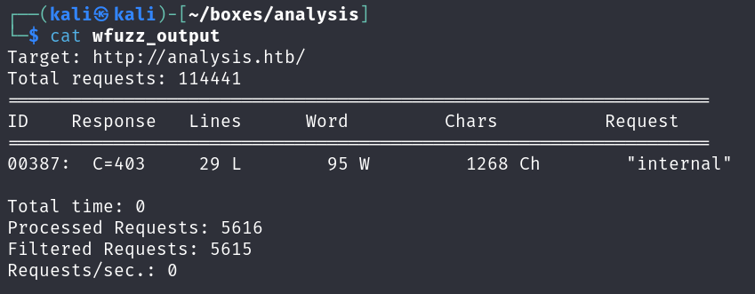
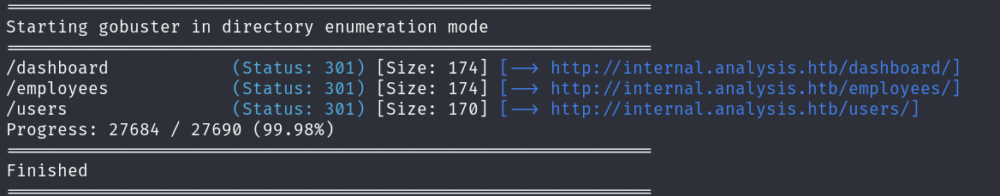
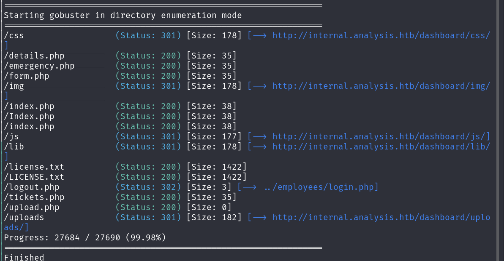
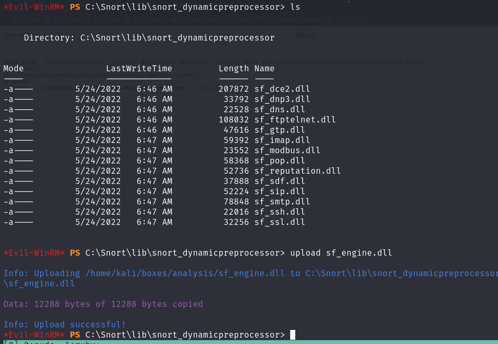

# HackTheBox - Analysis

## Enumeration

We start with our Nmap scan which reveals a flurry of ports.

```
# Nmap 7.94SVN scan initiated Thu May 30 02:59:08 2024 as: nmap -sCV -oN nmap/output 10.10.11.250
Nmap scan report for 10.10.11.250
Host is up (0.029s latency).
Not shown: 987 closed tcp ports (conn-refused)
PORT     STATE SERVICE       VERSION
53/tcp   open  domain        Simple DNS Plus
80/tcp   open  http          Microsoft HTTPAPI httpd 2.0 (SSDP/UPnP)
|_http-title: Not Found
|_http-server-header: Microsoft-HTTPAPI/2.0
88/tcp   open  kerberos-sec  Microsoft Windows Kerberos (server time: 2024-05-30 06:59:15Z)
135/tcp  open  msrpc         Microsoft Windows RPC
139/tcp  open  netbios-ssn   Microsoft Windows netbios-ssn
389/tcp  open  ldap          Microsoft Windows Active Directory LDAP (Domain: analysis.htb0., Site: Default-First-Site-Name)
445/tcp  open  microsoft-ds?
464/tcp  open  kpasswd5?
593/tcp  open  ncacn_http    Microsoft Windows RPC over HTTP 1.0
636/tcp  open  tcpwrapped
3268/tcp open  ldap          Microsoft Windows Active Directory LDAP (Domain: analysis.htb0., Site: Default-First-Site-Name)
3269/tcp open  tcpwrapped
3306/tcp open  mysql         MySQL (unauthorized)
Service Info: Host: DC-ANALYSIS; OS: Windows; CPE: cpe:/o:microsoft:windows

Host script results:
| smb2-time: 
|   date: 2024-05-30T06:59:18
|_  start_date: N/A
| smb2-security-mode: 
|   3:1:1: 
|_    Message signing enabled and required

Service detection performed. Please report any incorrect results at https://nmap.org/submit/ .
# Nmap done at Thu May 30 02:59:35 2024 -- 1 IP address (1 host up) scanned in 27.50 seconds
```

We try and perform our GoBuster scan on the default domain although are unsuccessful and don't appear to have anything else from our nmap scan to focus on. With this, we test for subdomains with the following command and then analyse the output.

```
┌──(kali㉿kali)-[~/boxes/analysis]
└─$ wfuzz -c -f wfuzz_output -w /usr/share/seclists/Discovery/DNS/subdomains-top1million-110000.txt -u "http://analysis.htb" -H "Host: FUZZ.analysis.htb" --hl 6
```

<figure><figcaption></figcaption></figure>

Analysing our output, we have the "internal" subdomain so add this to our /etc/hosts then begin enumerating due to the empty webpage on "internal.analysis.htb". From our GoBuster scan we find the three directories.

<figure><figcaption></figcaption></figure>

The dashboard directory appears to have lots of files that don't hold any data at this point in time besides a license file that doesn't appear to reveal any information of importance.

<figure><figcaption></figcaption></figure>

The employees directory was empty whilst the users directory returned one entry, an entry of importance, list.php. Navigating to this page shows us simply that we're missing a parameter.

<figure><figcaption></figcaption></figure>

With this in mind, we load up Arjun, which is a useful tool for doing parameter fuzzing and find the parameter we're missing.

<figure><figcaption></figcaption></figure>

Placing the "name" parameter into our URL reveals a table with what appears to be personal information, although no data passed by default.

<figure><figcaption></figcaption></figure>

The next step seems like an obvious one by passing the "\*" wildcard to display all data which gives us a username!&#x20;

<figure><figcaption></figcaption></figure>

## User&#x20;

Unfortunately at this point I reached an angle where I felt out of my depth, so decided to go back to the basics and conducted another nmap scan, but across all ports. We run the same flags but just adding the additional search for all ports and find further information for the port 33060 which appears to be related to LDAP permissions.

```
33060/tcp open  mysqlx?
| fingerprint-strings: 
|   DNSStatusRequestTCP, LDAPSearchReq, NotesRPC, SSLSessionReq, TLSSessionReq, X11Probe, afp: 
|     Invalid message"
|     HY000
|   LDAPBindReq: 
|     *Parse error unserializing protobuf message"
|     HY000
|   oracle-tns: 
|     Invalid message-frame."
|_    HY000
```

Of specific interest is the "LDAPSearchReq" fingerprint strings, so doing some research into this function we find that it is responsible for performing search operations in LDAPv3 and returning results that match a certain criteria. That appears to match what we have here, so what syntax do we need to make our own query?



After some more research and lots of interesting learning points, we stumbled across an article on the official LDAP website which outlines making queries and the various syntax required to make queries.



From this web page, we are specifically in the "presence filters" as we're looking for a user password. Now we know that the password would show, assuming we got the character and the query correct, so it was just a case of bruteforcing the password until we got one that worked entirely. So let's build our script...


We leave our script to run and eventually get our password.

<figure><figcaption></figcaption></figure>

So we have a set of credentials, let's take these to the login page we found earlier and go from there. Sure enough, using the credentials we've found, we log in successfully!

<figure><figcaption></figcaption></figure>

Immediately we notice the "SOC Report" which leads us to a file upload which we straight throw our reverse shell into.

<figure><figcaption></figcaption></figure>

Unfortunately we're denied, so we revert to a more basic reverse shell and instead head for code execution, knowing that this is a Windows machine we'll need to ensure we're using Windows commands instead of Linux ones.

<figure><figcaption></figcaption></figure>

Sure enough, we're successful the second time when using a simplified shell from revshells.com so now just have to find our file.. From our earlier enumeration we know that there's an uploads directory following the dashboards directory, so make a wild guess that our shell will be there.&#x20;

<figure><figcaption></figcaption></figure>

We run the commands you'd expect and find that we are the svc\_web user, so let's generate our own shell. Our first step is to generate our reverse shell then provide the necessary binaries on the target machine, in this instance, we're going to need a Windows Netcat binary. We start by getting our shell and netcat binary into the same folder and then launch our own webserver.

<figure><figcaption></figcaption></figure>

The reason we're using both a msfvenom and NC binary is incase the other fails, luckily, following some fine tuning, we can ignore the netcat binary and rely solely on Metasploit. We upload our msfvenom binary and then load metasploit, using `multi/handler` as this is responsible for catching Metasploit reverse shells and then configure the necessary settings before gaining a stabilised shell.

<figure><figcaption></figcaption></figure>

<figure><figcaption></figcaption></figure>

We have a shell but still no user, we try to enter all of the user directories but are unsuccessful with them all.&#x20;

<figure><figcaption></figcaption></figure>

We could drop winPEAS or utilise meterpreter capabilities to enumerate our current situation, but before we do that, there must be some kind of credentials that were used to access the LDAP services that we discovered on list.php, so we head there and look at the contents of the file. As we had hoped, at the top of the file we have credentials for the "webservice" user, which is a user we'd found attempting to access user directories.

<figure><figcaption></figcaption></figure>

Since there's credentials for the "webservice" user, we could also look for credentials for "wsmith", "jdoe" and "soc\_analyst", so let's have a look over the rest of these web pages. Sure enough we find another set of credentials for the database in login.php which we utilised to gain this shell.

<figure><figcaption></figcaption></figure>

Following some AD exploitation methodology we also decide to check registry keys for anything that may be of importance.

{% embed url="https://github.com/Integration-IT/Active-Directory-Exploitation-Cheat-Sheet/blob/master/O%20-%20Looting/README.md" %}

We're particularly interested in finding any credentials that we can so we take our cmd shell into PowerShell and execute the necessary commands to find this information.

<figure><figcaption></figcaption></figure>

<figure><figcaption></figcaption></figure>

Sure enough, those are credentials for jdoe. That gives us credentials for every user besides soc\_analyst, but we'll look into that later. Let's get off of our meterpreter shell and into something more proper. We load up evil-winrm and are successful in logging in.

<figure><figcaption></figcaption></figure>

## Root

Whilst enumerating the current users earlier in this, we noticed that there was a Snort log, and consequently a Snort directory in the base of the file system. This is quite weird for a CTF and thus quite interesting for us. We find the executable binary and check the version by adding the `-V` flag.

<figure><figcaption></figcaption></figure>

We Google for this version and privilege escalations and find an article on DLL hijacking.



So we start by generating another reverse shell.

<figure><figcaption></figcaption></figure>

We then need to create a pcap file to read, we so create en empty pcap file in the C:\private directory.

<figure><figcaption></figcaption></figure>

All we then need to do, is run Snort and call this pcap file, and our shell should generate itself. We run Snort and call the pcap file and then wait..

<figure><figcaption></figcaption></figure>

A minute or two passes and then we gain a reverse shell on our meterpreter shell!

<figure><figcaption></figcaption></figure>

This gives us root and marks the finish of this box!&#x20;
