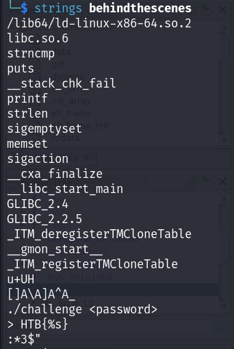
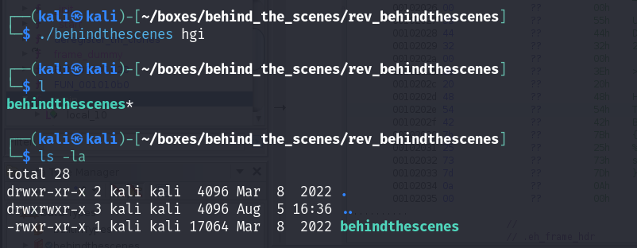
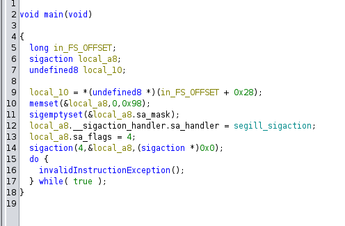
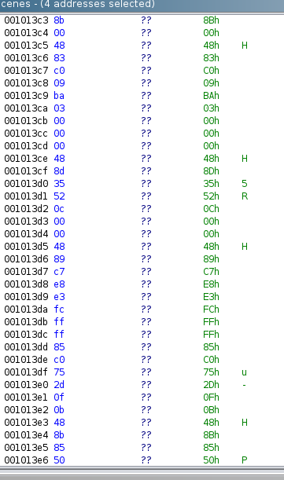
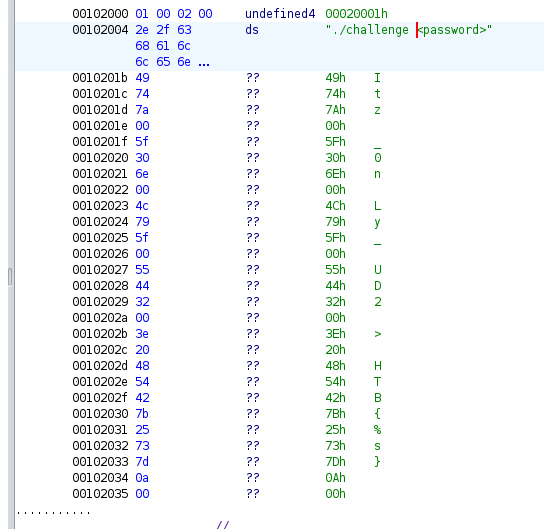

# HackTheBox - Behind The Scenes

This is a slightly different challenge from normal but we download the necessary files and since this is a reverse engineering challenge we start by looking at the strings of the binary that we have.

<figure><figcaption></figcaption></figure>

We notice a couple of interesting things from this binary including some C function calls and a usage for the binary with "./challenge \<password>". From this, we assume that we can just pass a password to the binary and see how it responds, to which we do, and get no visible response.

<figure><figcaption></figcaption></figure>

Having no luck, we decide to load up Ghidra. We look through the binary and look at the main function, but find nothing of particular interest.

<figure><figcaption></figcaption></figure>

Curious since we'd seen the usage of the binary through our strings usage, we begin scrolling down from the main function and find a large amount of comments.

<figure><figcaption></figcaption></figure>

We scroll further down and eventually stumble on a mention of the string we'd found from earlier, and then find something that, despite its randomness, represents our flag!

<figure><figcaption></figcaption></figure>

This particularly stood out for me was the triangle bracket which indicated that this flag was being passed onto the function. Following some tinkering around to make it into some kind of recognisable format we get HTB{Itz\_0nLy\_UD2} which is our flag!
