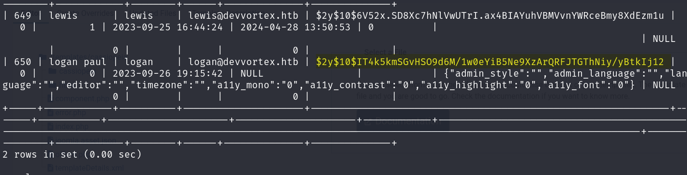

# HackTheBox - Devvortex

As usual, we start with our nmap scan and see we have two ports open, SSH & HTTP.

```
# Nmap 7.93 scan initiated Sat Jan 20 10:39:27 2024 as: nmap -sCV -oN nmap/output 10.10.11.242
Nmap scan report for 10.10.11.242
Host is up (0.059s latency).
Not shown: 998 closed tcp ports (conn-refused)
PORT   STATE SERVICE VERSION
22/tcp open  ssh     OpenSSH 8.2p1 Ubuntu 4ubuntu0.9 (Ubuntu Linux; protocol 2.0)
| ssh-hostkey: 
|   3072 48add5b83a9fbcbef7e8201ef6bfdeae (RSA)
|   256 b7896c0b20ed49b2c1867c2992741c1f (ECDSA)
|_  256 18cd9d08a621a8b8b6f79f8d405154fb (ED25519)
80/tcp open  http    nginx 1.18.0 (Ubuntu)
|_http-server-header: nginx/1.18.0 (Ubuntu)
|_http-title: Did not follow redirect to http://devvortex.htb/
Service Info: OS: Linux; CPE: cpe:/o:linux:linux_kernel

Service detection performed. Please report any incorrect results at https://nmap.org/submit/ .
# Nmap done at Sat Jan 20 10:39:44 2024 -- 1 IP address (1 host up) scanned in 16.77 seconds
```

We add "devvortex.htb" to our /etc/hosts and then navigate to the domain. Whilst doing this we run Gobuster but find nothing of interest.

<figure><figcaption></figcaption></figure>


We look over the website and have a look at what we can find but to not avail, so we move our focus to subdomains. We copy the same command from my writeup for TryHackMe - Creative and see what we find.&#x20;

```
wfuzz -c -f wfuzz_output -w /usr/share/seclists/Discovery/DNS/subdomains-top1million-110000.txt -u "http://devvortex.htb" -H "Host: FUZZ.devvortex.htb"
```


[tryhackme-creative.md](tryhackme-creative.md)



We let our command execute and get a hit on "dev.devvortex.htb", so head over to our /etc/hosts file and add this submission.

<figure><figcaption></figcaption></figure>

We navigate to the website and boot up GoBuster again, getting a hit for "/administrator" and "/api".

<figure><figcaption></figcaption></figure>

We head to "/administrator" and are given a Joomla login page. Knowing this we boot up "JoomScan", a useful equivalent to WPScan for WordPress websites and find that this website is running  Joomla 4.2.6

<figure><figcaption></figcaption></figure>

After this, we Google the Joomla version followed by "exploit" and find a GitHub page and a page explaining the vulnerability. We copy the GitHub repository and install the necessary ruby files, then launch our exploit...

<figure><figcaption></figcaption></figure>

<figure><figcaption></figcaption></figure>

Boom! We have credentials! We log into the Administator panel and are greeted with the administrator panel!

<figure><figcaption></figcaption></figure>

In a similar fashion to WordPress websites, we can upload a reverse-shell to the error.php file in the template directory and get straight onto the box. To do this we host a malicious bash script on our local machine, start a HTTP server and include a PHP "system" call which will download the bash script, then executing it on the boxes side.

<figure><figcaption></figcaption></figure>

<figure><figcaption></figcaption></figure>


With our shell uploaded and our reverse shell listener waiting, we just have to load the page and it should work...

<figure><figcaption></figcaption></figure>

We stabilise our shell on the box and know that since we're running a Joomla service, we have a MySQL service running. We log in using the same credentials we used for the administrator panel and they work! We do some enumeration and find a hash for the other user we found earlier, Logan. We copy it over and boot it up with Hashcat.

<figure><figcaption></figcaption></figure>

Hashcat gets a hit! We take these credentials and log into the SSH server as Logan.

<figure><figcaption></figcaption></figure>

As always, we start by checking if there is any binaries we can run as sudo, with one resultm "apport-cli".

<figure><figcaption></figcaption></figure>


We try to run the binary but since there are no crash reports, cannot do so. We run it again with "--help" and see we can run it with the "-f" flag to search for issues.&#x20;

<figure><figcaption></figcaption></figure>

We run it again with this flag and test where we get to through the process and we are given the option to view the crash report. We know we can execute commands through certain text editors such as "vi" or "less" so are hopeful that we're in one of those editors.

<figure><figcaption></figcaption></figure>

<figure><figcaption></figcaption></figure>


We place "#!/bin/bash" into this area, and sure enough! We get root!



<figure><figcaption></figcaption></figure>
