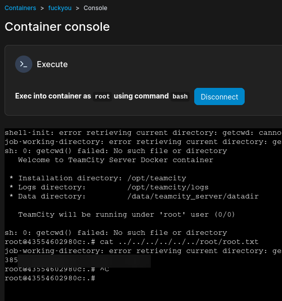

# HackTheBox - Runner

## Enumeration

As usual we start with our Nmap script which reveals a webpage on port 80 and 8080.

```
Starting Nmap 7.94SVN ( https://nmap.org ) at 2024-08-22 07:57 EDT
Nmap scan report for 10.10.11.13
Host is up (0.034s latency).
Not shown: 997 closed tcp ports (conn-refused)
PORT     STATE SERVICE     VERSION
22/tcp   open  ssh         OpenSSH 8.9p1 Ubuntu 3ubuntu0.6 (Ubuntu Linux; protocol 2.0)
| ssh-hostkey: 
|   256 3e:ea:45:4b:c5:d1:6d:6f:e2:d4:d1:3b:0a:3d:a9:4f (ECDSA)
|_  256 64:cc:75:de:4a:e6:a5:b4:73:eb:3f:1b:cf:b4:e3:94 (ED25519)
80/tcp   open  http        nginx 1.18.0 (Ubuntu)
|_http-server-header: nginx/1.18.0 (Ubuntu)
|_http-title: Did not follow redirect to http://runner.htb/
8000/tcp open  nagios-nsca Nagios NSCA
|_http-title: Site doesn't have a title (text/plain; charset=utf-8).
Service Info: OS: Linux; CPE: cpe:/o:linux:linux_kernel

Service detection performed. Please report any incorrect results at https://nmap.org/submit/ .
Nmap done: 1 IP address (1 host up) scanned in 8.41 seconds
```

The website on port 80 doesn't appear to have anything of use and port 8000 provides a version but nothing of use.

<figure><figcaption></figcaption></figure>

We run a scan to check for subdomains but don't find anything so decide to get creative with our wordlist.

<figure><figcaption></figcaption></figure>

We use "cewl", a command line tool for generating custom wordlists, to run the output against the domain, to search for any subdomains of interest which brings us to "TeamCity".

<figure><figcaption></figcaption></figure>

We alter our `/etc/hosts` to reflect this and then head to the subdomain. We're with a login page which also contains a version, we take that version and search for any vulnerabilities which is successful!

<figure><figcaption></figcaption></figure>

## User

We find our POC through an exploit-db page which allows us to create our own administrative account.



We download and run the exploit, and get credentials!

<figure><figcaption></figcaption></figure>

From here we log in and view the users, which reveals some useful information for later on in this box.

<figure><figcaption></figcaption></figure>

We notice a "backup" tab which when we click on allows us to backup the server settings and the database! So we run the backup and download it onto our machine and go searching!

<figure><figcaption></figcaption></figure>

<figure><figcaption></figcaption></figure>

We get some hashes from here so take the two for the users we mentioned earlier and attempt to crack them in Hashcat.

<figure><figcaption></figcaption></figure>

Hashcat runs for a few minutes before we find that the hash for the "Matthew" user is "piper123". The other password hash would not be cracked by Hashcat. We try to login as both of these users with the password specified but it does not work so we assume that we've missed something and head back to the database dump that we found. We spend some time doing our enumeration and eventually find an SSH key so then try this for the various users finding that it works for john, this gives us our user.txt.

<figure><figcaption></figcaption></figure>

## Root

Instantly, from the information above we can see that we are also operating on an internal network so look at any internal ports that are running. This reveals a few ports and tells us what we need to do next...

<figure><figcaption></figcaption></figure>

We're going to go ahead and configure a dynamic port forward from the box now...


We're going to start by using an SSH tunnel to open up the internal ports on the box..

<figure><figcaption></figcaption></figure>

We pass "-D" which specifies the port on our localhost to use to forward connections through, and then include the syntax to log into the box. This command will run with no confirmation that it has worked. We then configure ProxyChains, which is a useful tool for utilising portforwarding and add a line that matches the address we've specified for our "-D" flag.

<figure><figcaption></figcaption></figure>

We can then test that this has worked by running an nmap scan against port 9000 against localhost to see whether it is open.

<figure><figcaption></figcaption></figure>

Great! Let's start exploring, we'll go for port 9000 since we used this as our test for the box. We find that despite our best efforts we cannot load the webpage in a browser, although we can view the contents from a CURL request, so instead switch our port forwarding method to avoid ProxyChains.

<figure><figcaption></figcaption></figure>

We instead run the following, which gives us the webpage and loads it instantly!

<figure><figcaption></figcaption></figure>

<figure><figcaption></figcaption></figure>

Once logged in, we see that we have a docker container and two images.&#x20;

<figure><figcaption></figcaption></figure>

<figure><figcaption></figcaption></figure>


At this point I was considerably lost and couldn't figure out my way through until I consulted some other hackers who pointed me in the direction of this vulnerability.



Seemingly if we just change our working directory to `/proc/self/fd/8` we should be able to abuse a directory traversal vulnerability for root. We start by configuring our image to be that of the `teamcity:latest` build using the SHA256 hash, and configure our working directory to be that specified in the vulnerability documentation and run our container!

<figure><figcaption></figcaption></figure>

<figure><figcaption></figcaption></figure>

Sure enough, we specify that we want to run as "root" and we get our root flag!&#x20;

<figure><figcaption></figcaption></figure>

