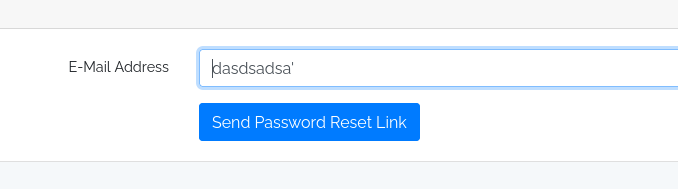
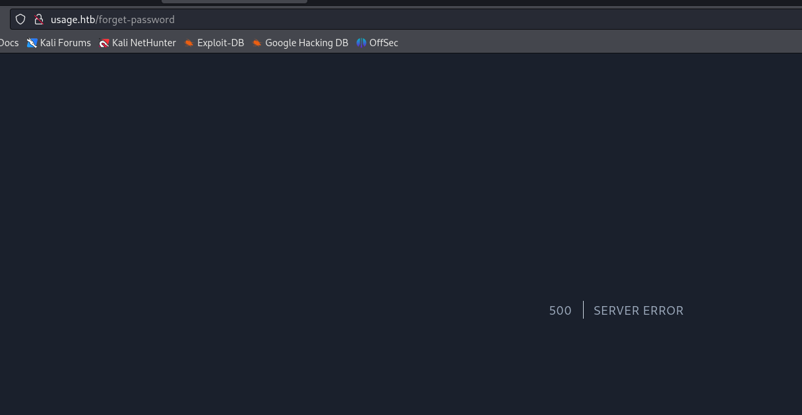
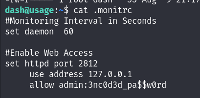
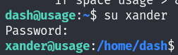

# HackTheBox - Usage

## Enumeration

As usual we start off with our nmap scan which just reveals a HTTP page and an SSH server.

```
# Nmap 7.94SVN scan initiated Mon Jun  3 16:17:24 2024 as: nmap -sCV -oN nmap/output 10.10.11.18
Nmap scan report for 10.10.11.18
Host is up (0.028s latency).
Not shown: 998 closed tcp ports (conn-refused)
PORT   STATE SERVICE VERSION
22/tcp open  ssh     OpenSSH 8.9p1 Ubuntu 3ubuntu0.6 (Ubuntu Linux; protocol 2.0)
| ssh-hostkey: 
|   256 a0:f8:fd:d3:04:b8:07:a0:63:dd:37:df:d7:ee:ca:78 (ECDSA)
|_  256 bd:22:f5:28:77:27:fb:65:ba:f6:fd:2f:10:c7:82:8f (ED25519)
80/tcp open  http    nginx 1.18.0 (Ubuntu)
|_http-title: Did not follow redirect to http://usage.htb/
|_http-server-header: nginx/1.18.0 (Ubuntu)
Service Info: OS: Linux; CPE: cpe:/o:linux:linux_kernel

Service detection performed. Please report any incorrect results at https://nmap.org/submit/ .
# Nmap done at Mon Jun  3 16:17:32 2024 -- 1 IP address (1 host up) scanned in 8.02 seconds

```

We alter our `/etc/hosts` to reflect the domain we've made and head to the page. We find a simple login page with an indication of an "admin" page which leads us to our second `/etc/hosts` entry of "admin.usage.htb". On the admin page we find another login page for Admins.

<figure><figcaption></figcaption></figure>

Curious to find some kind of credentials, we begin searching for anything of interest and try SQLi payloads on the various forms across the two domains and find that we can trigger an Internal Server Error with a payload that includes single quotation marks in the forgotten password form.

<figure><figcaption></figcaption></figure>

<figure><figcaption></figcaption></figure>

Having found an SQLi vulnerability we pass this onto SQLMAP and eventually, after some fine tuning and altering we find a password hash!

<figure><figcaption></figcaption></figure>

<figure><figcaption></figcaption></figure>

We pass this onto Hashcat and since it's a Bcrypt hash, crack it and get a set of credentials!

<figure><figcaption></figcaption></figure>

We take our new found credentials of `admin:whatever1` and attempt to log into the admin page. Which is successful!

<figure><figcaption></figcaption></figure>

## User

From here, we don't see anything of particular interest but we do decide to poke around the profile page. We notice that we can change the profile picture so take a PHP reverse shell and rename it to include an image filetype.&#x20;

<figure><figcaption></figcaption></figure>

We then try to access the file but are unsuccessful.

<figure><figcaption></figcaption></figure>

Continuing to test the filter, we alter it during Burp to add ".php" onto the end after we alter the request and see whether that makes any difference.

<figure><figcaption></figcaption></figure>

As soon as we fire the request off, we get a shell!

<figure><figcaption></figcaption></figure>

We realise we're the user "dash" so check whether we have our `user.txt` flag and we do. We also have our SSH key, which we copy over to our machine and then use to get a stable shell on the box.

<figure><figcaption></figcaption></figure>

<figure><figcaption></figcaption></figure>

## Lateral Movement

With our SSH connection on the box, we check our current folder again and find the `.monitrc` file appears executable. We read the file and find credentials for another user on the box, we check our `/etc/passwd` and find the user "Xander" so try this new password for them.

<figure><figcaption></figcaption></figure>

<figure><figcaption></figcaption></figure>

<figure><figcaption></figcaption></figure>

## Root

We check our sudo privileges and have access to a binary called `usage_management`. &#x20;

<figure><figcaption></figcaption></figure>

We check the strings of the binary and instantly notice something of use...

<figure><figcaption></figcaption></figure>

We notice that a wildcard is used that seems to simply zip everything from `/var/www/html` and zip it to be stored at `/var/backups/project.zip`. We take this information and do our own research and check for wildcard abuse with 7zip which we find through HackTricks!



We follow the steps and then run our binary, which gives us our root flag!

<figure><figcaption></figcaption></figure>

Although at this point we have the box complete, we might want to go for persistence which we can simply do by trying for the `id_rsa` flag of the root user. Which we can do by adjusting our payload...

<figure><figcaption></figcaption></figure>

We can then get our key at the end of the output and simply SSH as the root user.

<figure><figcaption></figcaption></figure>
