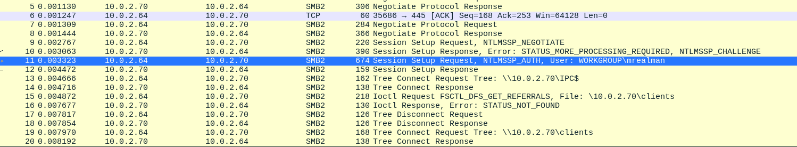

# TryHackMe - Block

This is a slightly different room then we'd normally go for but let's get into it.


We have a DMP file and a Wireshark capture. We start by saving the strings of the DMP file to a seperate file, since the DMP file itself is just 32 hexadecimal bits.

<figure><figcaption></figcaption></figure>

We save the strings of the file and then move onto the Wireshark capture, but intend to come back to this strings file.

<figure><figcaption></figcaption></figure>

## Flag 1 & 4

Moving onto the Wireshark file we our first username (and flag) pretty quickly. Just by viewing the packet information we can see that "mrealman" has connected to a SMB share. We also notice a way we could check for any other users, since we know we'll be looking for a second user for our fourth flag.

<figure><figcaption></figcaption></figure>

Great, so we have this information and we notice the NTLMSSP protocol being used in the middle of the information. Luckily for us, Wireshark has a filter specifically for NTLMSSP packets so we apply that filter and find our other username, "eshellstrop".

<figure><figcaption></figcaption></figure>

We then take this information and run a Grep command against our the strings found in our LSASS dump for anything of importance, but don't seem to find anything important yet.

<figure><figcaption></figcaption></figure>

## Flag 2

Moving onto user passwords, we notice that once the user has authenticated the process of getting an NTLM hash begins. For those unaware of the NTLM process, it follows a 7 step process between the client, application server and DC (Domain Controller).

1. Client calculates an NTLM hash based on the user's password
2. Client sends the username
3. Server responds with a challenge
4. Client encrypts the challenge with the hash and sends this back to the server
5. Server sends the response which includes the username to the DC
6. Since the DC knows the NTLM hash, it encrypts the challenge it sent in point 3 and compares the response to the hash it has stored.
7. If they are the same, the user is authenticated.


Great, now since we're capturing the packets of this process we could watch parts of this happen and craft our hash manually. Fortunately for us, there are tools that will do this for us, of particular interest is PCredz.



We copy PCredz to our Kali machine, install its dependencies and then run it and pass the only flag it should need, the PCAP file.

<figure><figcaption></figcaption></figure>

This gives us hashes for both users! Great, let's pass this over to Hashcat and let it do its magic. We start by putting the hashes into a file to make our life easier.

<figure><figcaption></figcaption></figure>

We then check Hashcat documentation and find that we're working with regular NetNTLMV2 hashes.

&#x20;

<figure><figcaption></figcaption></figure>

<figure><figcaption></figcaption></figure>

Hashcat finds our password for mrealman but not the other user. This gives us our second flag!

## Flag 3

So, we have plenty of useful information so how do we go about finding our first proper "flag". Well, let's try Google!&#x20;

<figure><figcaption></figcaption></figure>

We have a look through this article and it contains some useful information, specifically what we needed to decrypt the traffic:

* User’s password or NTLM hash&#x20;
* User’s domain&#x20;
* User’s username&#x20;
* NTProofStr&#x20;
* Key Exchange Key (Also known as the NTLMv2 Session Base Key)&#x20;
* Encrypted Session Key

Well we have the password, domain and username. We just need to the NTProofStr and Encrypted Session Key. Let's go searching! We find our session key in the authentication packet:

<figure><figcaption></figcaption></figure>

And then our NTProofStr further in the same packet.

<figure><figcaption></figcaption></figure>

So now we have everything, we copy the script from the article but just keep running into errors so decide to convert this to a Python3 script.

<figure><figcaption></figcaption></figure>

```python
import hashlib
import hmac
import argparse
from Cryptodome.Cipher import ARC4

def generate_encrypted_session_key(key_exchange_key, exported_session_key):
    cipher = ARC4.new(key_exchange_key)
    session_key = cipher.encrypt(exported_session_key)
    return session_key

parser = argparse.ArgumentParser(description="Calculate the Random Session Key based on data from a PCAP (maybe).")
parser.add_argument("-u", "--user", required=True, help="User name")
parser.add_argument("-d", "--domain", required=True, help="Domain name")
parser.add_argument("-p", "--password", required=True, help="Password of User")
parser.add_argument("-n", "--ntproofstr", required=True, help="NTProofStr. This can be found in PCAP (provide Hex Stream)")
parser.add_argument("-k", "--key", required=True, help="Encrypted Session Key. This can be found in PCAP (provide Hex Stream)")
parser.add_argument("-v", "--verbose", action="store_true", help="Increase output verbosity")

args = parser.parse_args()

# Upper Case User and Domain
user = str(args.user).upper().encode('utf-16le')
domain = str(args.domain).upper().encode('utf-16le')

# Create 'NTLM' Hash of password
password = hashlib.new('md4', args.password.encode('utf-16le')).digest()

# Calculate the ResponseNTKey
h = hmac.new(password, digestmod=hashlib.md5)
h.update(user + domain)
resp_nt_key = h.digest()

# Decode NTProofStr and calculate Key Exchange Key
nt_proof_str = bytes.fromhex(args.ntproofstr)
h = hmac.new(resp_nt_key, digestmod=hashlib.md5)
h.update(nt_proof_str)
key_exch_key = h.digest()

# Decode Encrypted Session Key and calculate Random Session Key
encrypted_session_key = bytes.fromhex(args.key)
rsess_key = generate_encrypted_session_key(key_exch_key, encrypted_session_key)

if args.verbose:
    print("USER WORK: ", user.decode('utf-16le'), domain.decode('utf-16le'))
    print("PASS HASH: ", password.hex())
    print("RESP NT:   ", resp_nt_key.hex())
    print("NT PROOF:  ", nt_proof_str.hex())
    print("KeyExKey:  ", key_exch_key.hex())
print("Random SK: ", rsess_key.hex())

```

We run our new script and get the Session Key!

<figure><figcaption></figcaption></figure>

Now, from the article we also identified we need the session ID to successfully decrypt the information, which we find from the same packet.

<figure><figcaption></figcaption></figure>

We fill in the necessary information and find that there are some more packets decoded!

<figure><figcaption></figcaption></figure>

We look through the packets and notice a file has been requested...

<figure><figcaption></figcaption></figure>

Since we have the decrypted data, we can just export the file and read it!

<figure><figcaption></figcaption></figure>

We open the file and boom... our first actual flag!

<figure><figcaption></figcaption></figure>

## Flag 5

We decide to get creative at this point since we need to find the NTLM hash of the user "eshellstrop". Since we haven't touched the LSASS dump yet we decide to look for tools that will allow us to retrieve information from the LSASS dump. We stumble across a simple tool that dumps the LSASS data into a DMP file, but not the contents itself, although this does indicate a way of going forwards.



<figure><figcaption></figcaption></figure>

We can read the information through Mimikatz, amazing! We copy the necessary information over to a Windows machine and follow the steps provided, which gives us our 5th flag!

<figure><figcaption></figcaption></figure>

<figure><figcaption></figcaption></figure>

## Flag 6

We have the necessary information to complete the same process again, but first we'll need to alter our script, since we already have it calculating the hash of whatever password we supply, we need to add an option to just do as we say.

```python
import hashlib
import hmac
import argparse
import binascii
from Cryptodome.Cipher import ARC4

def generate_encrypted_session_key(key_exchange_key, exported_session_key):
    cipher = ARC4.new(key_exchange_key)
    session_key = cipher.encrypt(exported_session_key)
    return session_key

parser = argparse.ArgumentParser(description="Calculate the Random Session Key based on data from a PCAP (maybe).")
parser.add_argument("-u", "--user", required=True, help="User name")
parser.add_argument("-d", "--domain", required=True, help="Domain name")
parser.add_argument("-p", "--password", help="Password of User")
parser.add_argument("-hh", "--hash", help="Hash")
parser.add_argument("-n", "--ntproofstr", required=True, help="NTProofStr. This can be found in PCAP (provide Hex Stream)")
parser.add_argument("-k", "--key", required=True, help="Encrypted Session Key. This can be found in PCAP (provide Hex Stream)")
parser.add_argument("-v", "--verbose", action="store_true", help="Increase output verbosity")

args = parser.parse_args()

# Upper Case User and Domain
user = str(args.user).upper().encode('utf-16le')
domain = str(args.domain).upper().encode('utf-16le')

# Create 'NTLM' Hash of password
if args.password:
    password = hashlib.new('md4', args.password.encode('utf-16le')).digest()
else:
    password = binascii.unhexlify(args.hash)

# Calculate the ResponseNTKey
h = hmac.new(password, digestmod=hashlib.md5)
h.update(user + domain)
resp_nt_key = h.digest()

# Decode NTProofStr and calculate Key Exchange Key
nt_proof_str = bytes.fromhex(args.ntproofstr)
h = hmac.new(resp_nt_key, digestmod=hashlib.md5)
h.update(nt_proof_str)
key_exch_key = h.digest()

# Decode Encrypted Session Key and calculate Random Session Key
encrypted_session_key = bytes.fromhex(args.key)
rsess_key = generate_encrypted_session_key(key_exch_key, encrypted_session_key)

if args.verbose:
    print("USER WORK: ", user.decode('utf-16le'), domain.decode('utf-16le'))
    print("PASS HASH: ", password.hex())
    print("RESP NT:   ", resp_nt_key.hex())
    print("NT PROOF:  ", nt_proof_str.hex())
    print("KeyExKey:  ", key_exch_key.hex())
print("Random SK: ", rsess_key.hex())

```


After we've done that, we'll pass the necessary information over in a similar fashion to [#flag-3](tryhackme-block.md#flag-3 "mention") and get our secret key!

<figure><figcaption></figcaption></figure>

We grab our session ID then input the necessary information into the decryption key...

<figure><figcaption></figcaption></figure>

<figure><figcaption></figcaption></figure>

This then gives us our file, which we can download and find our final flag in!

<figure><figcaption></figcaption></figure>

<figure><figcaption></figcaption></figure>
