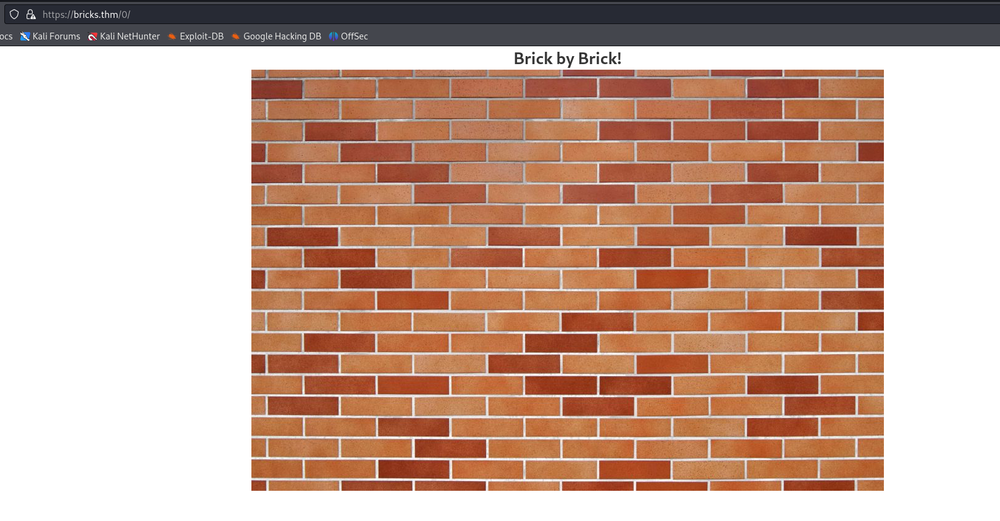
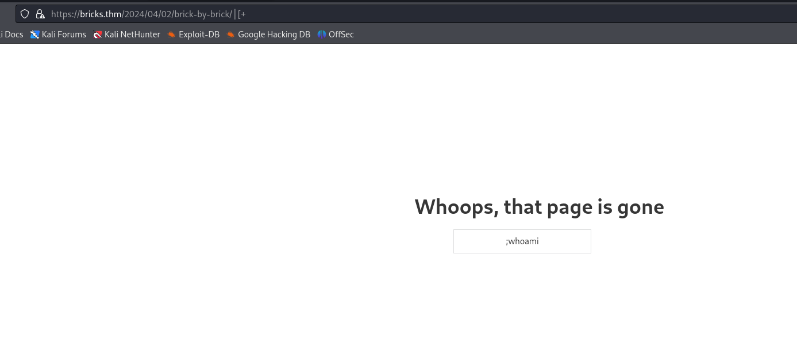
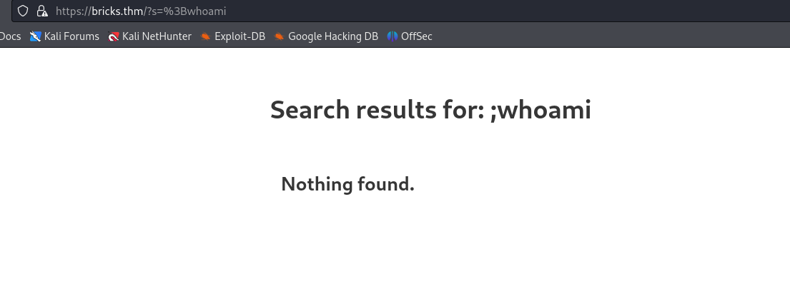
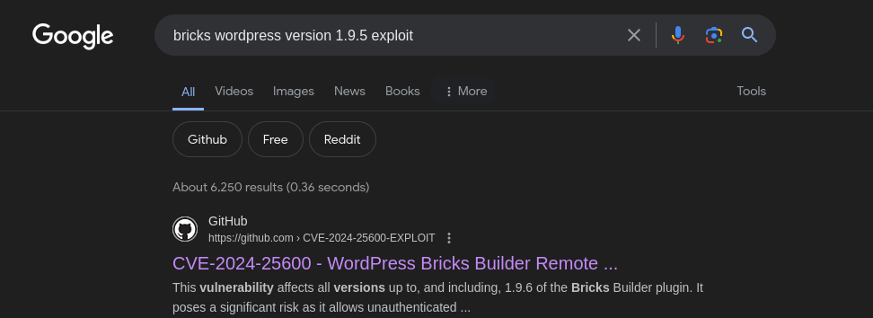
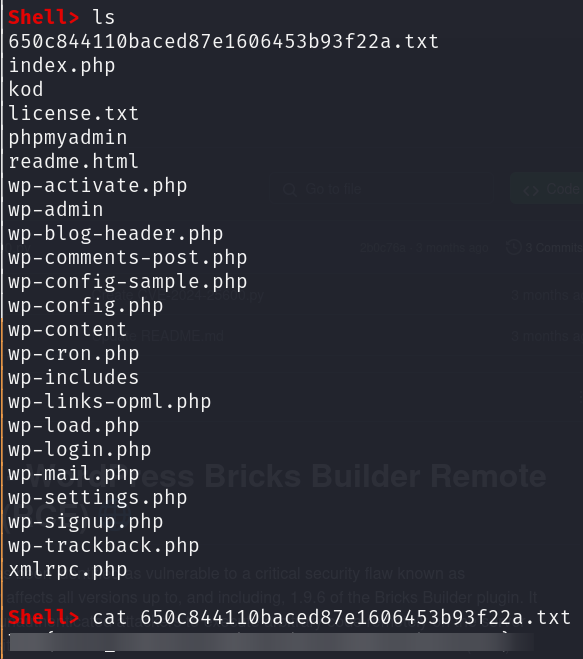
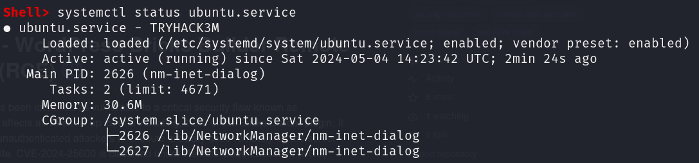
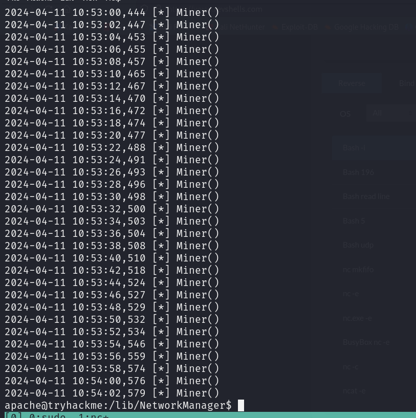
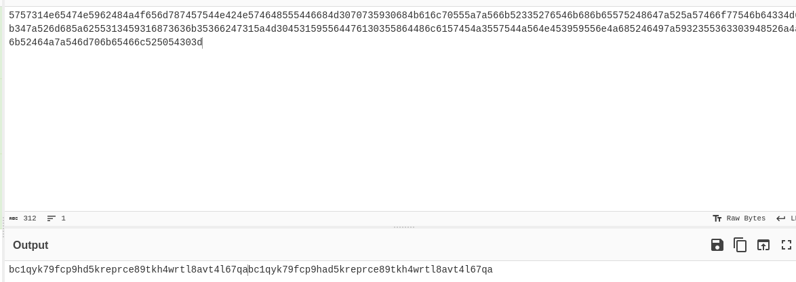
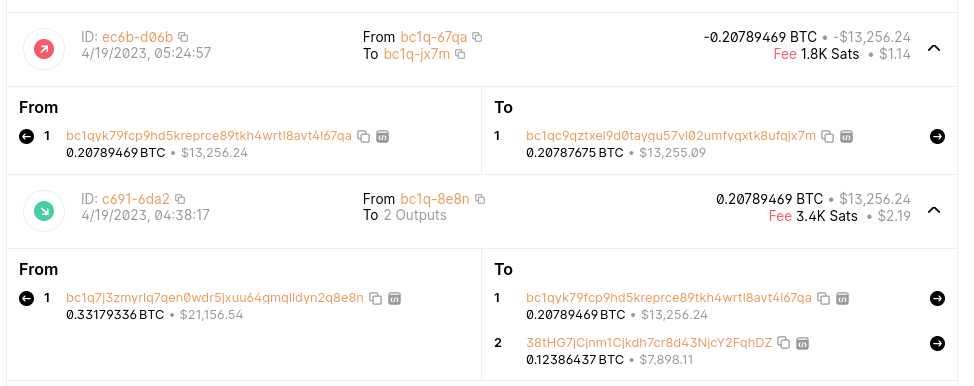
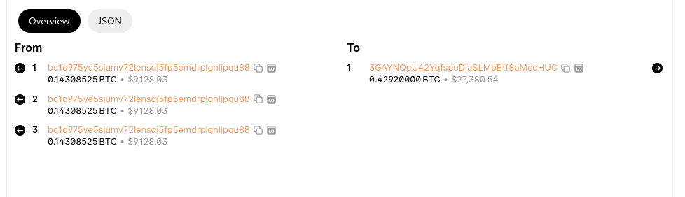

# TryHackMe - Bricks Heist


## Recon

As usual we start with our nmap scan which reveals SSH, HTTP, HTTPS and MySQL running.

```
# Nmap 7.94SVN scan initiated Sat May  4 10:02:24 2024 as: nmap -sCV -oN nmap/output 10.10.225.113
Nmap scan report for 10.10.225.113
Host is up (0.030s latency).
Not shown: 996 closed tcp ports (conn-refused)
PORT     STATE SERVICE  VERSION
22/tcp   open  ssh      OpenSSH 8.2p1 Ubuntu 4ubuntu0.11 (Ubuntu Linux; protocol 2.0)
| ssh-hostkey: 
|   3072 34:7a:4b:70:33:e7:16:db:b6:10:f9:09:fd:66:30:ca (RSA)
|   256 84:2b:fd:ce:14:a0:00:ea:fa:8a:3b:c9:99:4f:10:56 (ECDSA)
|_  256 95:b5:00:8c:d4:9e:62:93:b9:bd:90:29:9b:ba:56:c3 (ED25519)
80/tcp   open  http     WebSockify Python/3.8.10
|_http-server-header: WebSockify Python/3.8.10
|_http-title: Error response
| fingerprint-strings: 
|   GetRequest: 
|     HTTP/1.1 405 Method Not Allowed
|     Server: WebSockify Python/3.8.10
|     Date: Sat, 04 May 2024 14:02:29 GMT
|     Connection: close
|     Content-Type: text/html;charset=utf-8
|     Content-Length: 472
|     <!DOCTYPE HTML PUBLIC "-//W3C//DTD HTML 4.01//EN"
|     "http://www.w3.org/TR/html4/strict.dtd">
|     <html>
|     <head>
|     <meta http-equiv="Content-Type" content="text/html;charset=utf-8">
|     <title>Error response</title>
|     </head>
|     <body>
|     <h1>Error response</h1>
|     <p>Error code: 405</p>
|     <p>Message: Method Not Allowed.</p>
|     <p>Error code explanation: 405 - Specified method is invalid for this resource.</p>
|     </body>
|     </html>
|   HTTPOptions: 
|     HTTP/1.1 501 Unsupported method ('OPTIONS')
|     Server: WebSockify Python/3.8.10
|     Date: Sat, 04 May 2024 14:02:30 GMT
|     Connection: close
|     Content-Type: text/html;charset=utf-8
|     Content-Length: 500
|     <!DOCTYPE HTML PUBLIC "-//W3C//DTD HTML 4.01//EN"
|     "http://www.w3.org/TR/html4/strict.dtd">
|     <html>
|     <head>
|     <meta http-equiv="Content-Type" content="text/html;charset=utf-8">
|     <title>Error response</title>
|     </head>
|     <body>
|     <h1>Error response</h1>
|     <p>Error code: 501</p>
|     <p>Message: Unsupported method ('OPTIONS').</p>
|     <p>Error code explanation: HTTPStatus.NOT_IMPLEMENTED - Server does not support this operation.</p>
|     </body>
|_    </html>
443/tcp  open  ssl/http Apache httpd
| ssl-cert: Subject: organizationName=Internet Widgits Pty Ltd/stateOrProvinceName=Some-State/countryName=US
| Not valid before: 2024-04-02T11:59:14
|_Not valid after:  2025-04-02T11:59:14
|_http-title: Brick by Brick
| tls-alpn: 
|   h2
|_  http/1.1
| http-robots.txt: 1 disallowed entry 
|_/wp-admin/
|_ssl-date: TLS randomness does not represent time
|_http-server-header: Apache
|_http-generator: WordPress 6.5
3306/tcp open  mysql    MySQL (unauthorized)
1 service unrecognized despite returning data. If you know the service/version, please submit the following fingerprint at https://nmap.org/cgi-bin/submit.cgi?new-service :
SF-Port80-TCP:V=7.94SVN%I=7%D=5/4%Time=66363FF4%P=x86_64-pc-linux-gnu%r(Ge
SF:tRequest,291,"HTTP/1\.1\x20405\x20Method\x20Not\x20Allowed\r\nServer:\x
SF:20WebSockify\x20Python/3\.8\.10\r\nDate:\x20Sat,\x2004\x20May\x202024\x
SF:2014:02:29\x20GMT\r\nConnection:\x20close\r\nContent-Type:\x20text/html
SF:;charset=utf-8\r\nContent-Length:\x20472\r\n\r\n<!DOCTYPE\x20HTML\x20PU
SF:BLIC\x20\"-//W3C//DTD\x20HTML\x204\.01//EN\"\n\x20\x20\x20\x20\x20\x20\
SF:x20\x20\"http://www\.w3\.org/TR/html4/strict\.dtd\">\n<html>\n\x20\x20\
SF:x20\x20<head>\n\x20\x20\x20\x20\x20\x20\x20\x20<meta\x20http-equiv=\"Co
SF:ntent-Type\"\x20content=\"text/html;charset=utf-8\">\n\x20\x20\x20\x20\
SF:x20\x20\x20\x20<title>Error\x20response</title>\n\x20\x20\x20\x20</head
SF:>\n\x20\x20\x20\x20<body>\n\x20\x20\x20\x20\x20\x20\x20\x20<h1>Error\x2
SF:0response</h1>\n\x20\x20\x20\x20\x20\x20\x20\x20<p>Error\x20code:\x2040
SF:5</p>\n\x20\x20\x20\x20\x20\x20\x20\x20<p>Message:\x20Method\x20Not\x20
SF:Allowed\.</p>\n\x20\x20\x20\x20\x20\x20\x20\x20<p>Error\x20code\x20expl
SF:anation:\x20405\x20-\x20Specified\x20method\x20is\x20invalid\x20for\x20
SF:this\x20resource\.</p>\n\x20\x20\x20\x20</body>\n</html>\n")%r(HTTPOpti
SF:ons,2B9,"HTTP/1\.1\x20501\x20Unsupported\x20method\x20\('OPTIONS'\)\r\n
SF:Server:\x20WebSockify\x20Python/3\.8\.10\r\nDate:\x20Sat,\x2004\x20May\
SF:x202024\x2014:02:30\x20GMT\r\nConnection:\x20close\r\nContent-Type:\x20
SF:text/html;charset=utf-8\r\nContent-Length:\x20500\r\n\r\n<!DOCTYPE\x20H
SF:TML\x20PUBLIC\x20\"-//W3C//DTD\x20HTML\x204\.01//EN\"\n\x20\x20\x20\x20
SF:\x20\x20\x20\x20\"http://www\.w3\.org/TR/html4/strict\.dtd\">\n<html>\n
SF:\x20\x20\x20\x20<head>\n\x20\x20\x20\x20\x20\x20\x20\x20<meta\x20http-e
SF:quiv=\"Content-Type\"\x20content=\"text/html;charset=utf-8\">\n\x20\x20
SF:\x20\x20\x20\x20\x20\x20<title>Error\x20response</title>\n\x20\x20\x20\
SF:x20</head>\n\x20\x20\x20\x20<body>\n\x20\x20\x20\x20\x20\x20\x20\x20<h1
SF:>Error\x20response</h1>\n\x20\x20\x20\x20\x20\x20\x20\x20<p>Error\x20co
SF:de:\x20501</p>\n\x20\x20\x20\x20\x20\x20\x20\x20<p>Message:\x20Unsuppor
SF:ted\x20method\x20\('OPTIONS'\)\.</p>\n\x20\x20\x20\x20\x20\x20\x20\x20<
SF:p>Error\x20code\x20explanation:\x20HTTPStatus\.NOT_IMPLEMENTED\x20-\x20
SF:Server\x20does\x20not\x20support\x20this\x20operation\.</p>\n\x20\x20\x
SF:20\x20</body>\n</html>\n");
Service Info: OS: Linux; CPE: cpe:/o:linux:linux_kernel

Service detection performed. Please report any incorrect results at https://nmap.org/submit/ .
# Nmap done at Sat May  4 10:03:55 2024 -- 1 IP address (1 host up) scanned in 91.09 seconds

```

We instantly notice that the robots.txt page on port 443 is hiding a WordPress page so we launch WPScan to find out more information regarding this, and also perform our own directory enumeration through GoBuster. Since we're testing against websites with an SSL certificate that is self-signed we'll need to use "-k" in our GoBuster & WPScan to run.

&#x20;

<figure><figcaption></figcaption></figure>

Visting bricks.thm/0 we aren't given any indication but this appears to be a file generated by WordPress, and the same with the additional files.


&#x20;

<figure><figcaption></figcaption></figure>

We test for basic code injection in the post although are unsuccessful.

<figure><figcaption></figcaption></figure>

<figure><figcaption></figcaption></figure>


## Flag 1

With this having been unsuccessful, we check our WPScan output and find a version which explains the constant bricks referneces, it's the theme!

<figure><figcaption></figcaption></figure>

Googling the template version we get an RCE vulnerability, CVE-2024-25600.&#x20;

<figure><figcaption></figcaption></figure>


We clone the exploit, install the dependencies and run it, which gives us a shell!

<figure><figcaption></figcaption></figure>

We check our current directory and get our first flag! We then begin looking for any services that appear to be out of the ordinary for flag #2.


## Flag 2 & 3

For the second flag, we're looking for a suspicous process that's running. We start by looking through the running services so we can narrow down what processes to look for using the following command.

```
systemctl list-units --type=service
```

From the output of this we notice that "ubuntu.service" is running "TRYHACK3M" which is presumably related to this challenge. We view the status of this service with the following command and get our answers for flag 2 & 3.

```
systemctl status ubuntu.service
```

<figure><figcaption></figcaption></figure>


## Flag 4

From the output of this command we notice where the process is running from there and therefore want to investigate any kind of configuration files related to the process although we run into a problem with this shell. We aren't able to navigate other directories besides our working directory. The solution? Spawn our own shell!

<figure><figcaption></figcaption></figure>

We spawn our own shell and navigate to `/lib/NetworkManager` then read the config file `inet.conf` which when reading the entirety, provides a large amount of output related to the miner. We look at the top of the file and notice this is a Bitcoin miner which contains an "ID".&#x20;


## Flag 5

Not knowing what we're looking at, we pass this over to CyberChef and after some playing around, identify this to be included with Hexadecimal, then Base64 encoded twice.&#x20;

<figure><figcaption></figcaption></figure>


Trying to paste the output from this into a Bitcoin wallet lookup won't work and this part caught me off guard. The output repeats itself twice so when split with the prefix "bc1qyk79fcp9" we get these two addresses.

```
bc1qyk79fcp9hd5kreprce89tkh4wrtl8avt4l67qa
bc1qyk79fcp9had5kreprce89tkh4wrtl8avt4l67qa
```

We start by looking through the transactions and notice two extremely large transactions of $13,256.24 between Bitcoin addreses to decide to follow these first.

<figure><figcaption></figcaption></figure>

We notice that by following these addresses the money is sent to a wallet ending "HUC". As such, we pass this onto another website, Blockchair, and look through their tools.

<figure><figcaption></figcaption></figure>

We notice the same transactions and decide to follow the sent address.

<figure><figcaption></figcaption></figure>

Unfortunately I spent quite a lot of time going through a loop of various addresses until eventually deciding that I'd overcomplicated this and needed to simplify it. As such, pasted the original address into Blockchair and instantly noticed a much larger transaction.&#x20;

<figure><figcaption></figcaption></figure>


We follow the received address and view the privacy issues and see the sender's Bitcoin address. We Google the address and see multiple sanctioning documents to this address, viewing an article reveals that the group this is associated to is LockBit.&#x20;

<figure><figcaption></figcaption></figure>
