# TryHackMe - Creative


## Enumeration

We start with our nmap scan which reveals 2 ports, HTTP and SSH. The HTTP server requires us to have our IP linked to the DNS URL "creative.thm", so we head to our /etc/hosts and add it there.

```
# Nmap 7.94SVN scan initiated Sun Apr 21 08:41:31 2024 as: nmap -sCV -oN nmap/output 10.10.80.217
Nmap scan report for 10.10.80.217
Host is up (0.058s latency).
Not shown: 998 filtered tcp ports (no-response)
PORT   STATE  SERVICE VERSION
22/tcp closed ssh
80/tcp open   http    nginx 1.18.0 (Ubuntu)
|_http-title: Did not follow redirect to http://creative.thm
|_http-server-header: nginx/1.18.0 (Ubuntu)
Service Info: OS: Linux; CPE: cpe:/o:linux:linux_kernel

Service detection performed. Please report any incorrect results at https://nmap.org/submit/ .
# Nmap done at Sun Apr 21 08:41:50 2024 -- 1 IP address (1 host up) scanned in 18.27 seconds

```

We then head to http://creative.thm and are greeted with a webpage that appears to be some kind of Bootstrap website.

<figure><figcaption></figcaption></figure>

We perform some basic enumeration of the website and don't find anything of use through clicking around the website and conducting a Gobuster scan.&#x20;

<figure>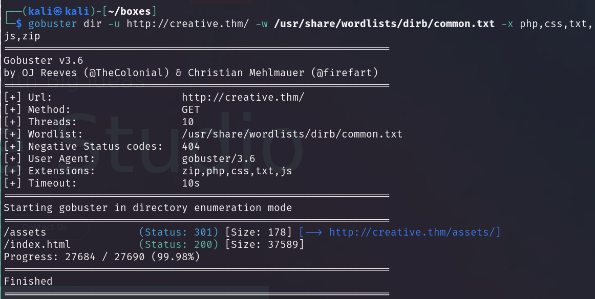<figcaption></figcaption></figure>

Finding nothing on the website and knowing that what we're looking for should be relatively simple so we launch wfuzz. We use the command `wfuzz -c -f wfuzz_output -w /usr/share/seclists/Discovery/DNS/subdomains-top1million-110000.txt -u "http://creative.thm" -H "Host: FUZZ.creative.thm"`

* \-c
  * Output with colours
* \-f
  * File to output the results to\

* \-w
  * Wordlist to fuzz with
* \-u
  * URL to use as our base
* \-H
  * Headers to include, this is where we do the fuzzing.&#x20;

I used the website below for the command mentioned above and sure enough, running the command but applied to our situation reveal the "beta" subdomain.



<figure>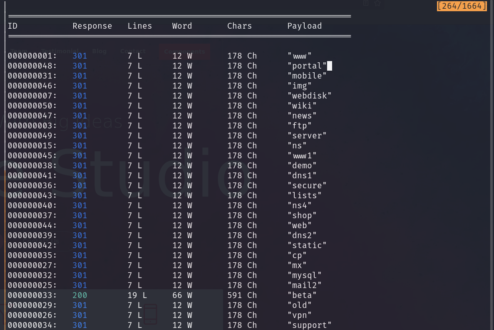<figcaption></figcaption></figure>

We add "beta.creative.thm" to our /etc/hosts and navigate to the webpage and are greeted with a page that tests an alive to see whether it is up or not. We start our local HTTP server and the contents of the page are reflected on http://beta.creative.thm. Since we successfully loaded our own IP, let's see what happens when we use "localhost", maybe there's a local web server running?

<figure>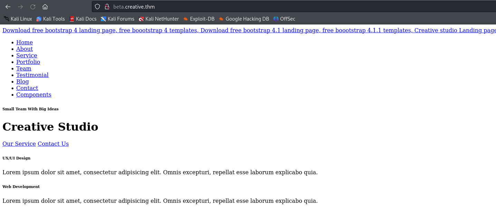<figcaption></figcaption></figure>


## User

Sure enough, we load the webpage from earlier minus the CSS content. Although proving that there isn't another webpage configured to be the default, we still don't know about on other local ports. We generate a wordlist with "crunch", which is a useful tool for wordlist generation, and plug it into Burp, waiting for a response length that is out of the ordinary.

<figure>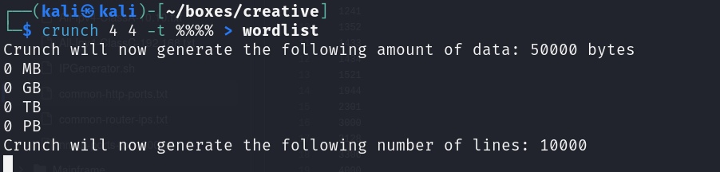<figcaption></figcaption></figure>

<figure>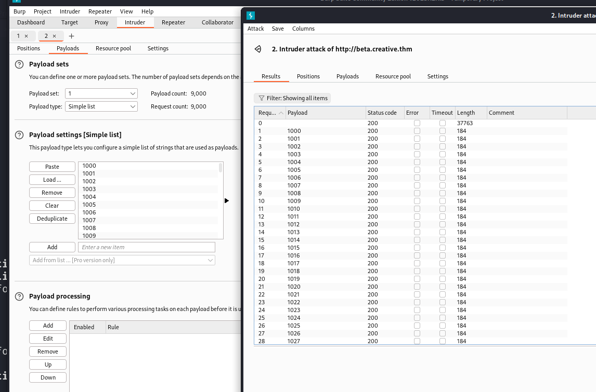<figcaption></figcaption></figure>

<figure>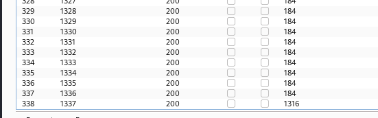<figcaption></figcaption></figure>

Eventually the intruder request came back and revealed for the user that port 1337 was open. Placing that IP into the search request reveal a directory listing for the server.&#x20;

<figure>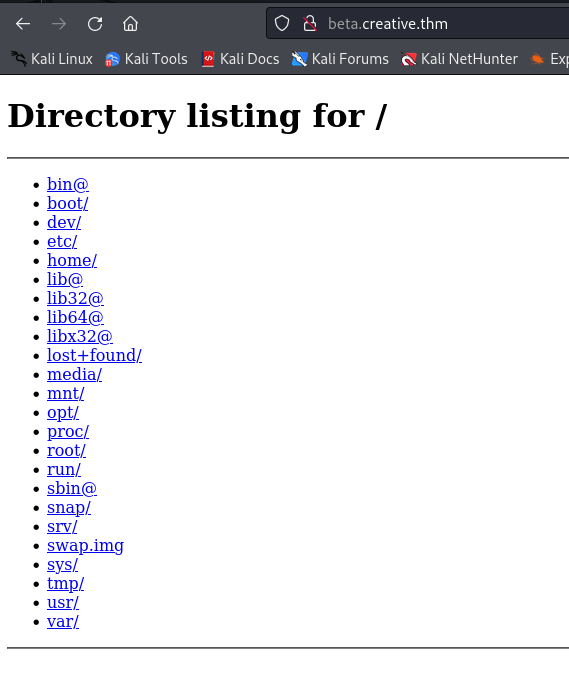<figcaption></figcaption></figure>

Snooping around we find a user in the home directory, saad, so we instantly assume that they have an SSH key. Sure enough, they do. We download the id\_rsa and attempt to login using it and are asked for the password, which we don't have. We pass the SSH key to John and then crack it, which reveals the password for us.

&#x20;

<figure>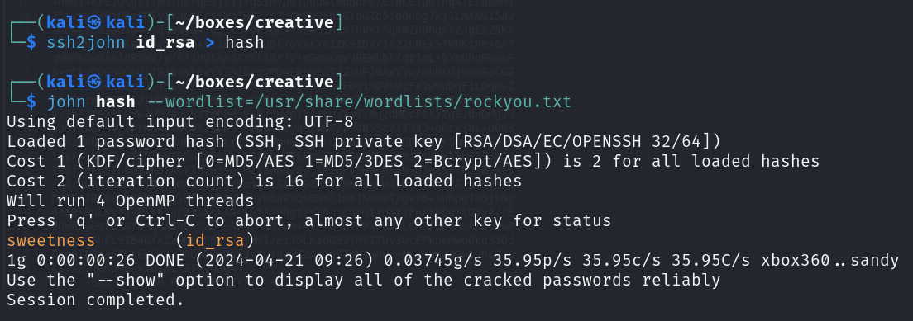<figcaption></figcaption></figure>

We login with that password and sure enough, that's user flag!

<figure>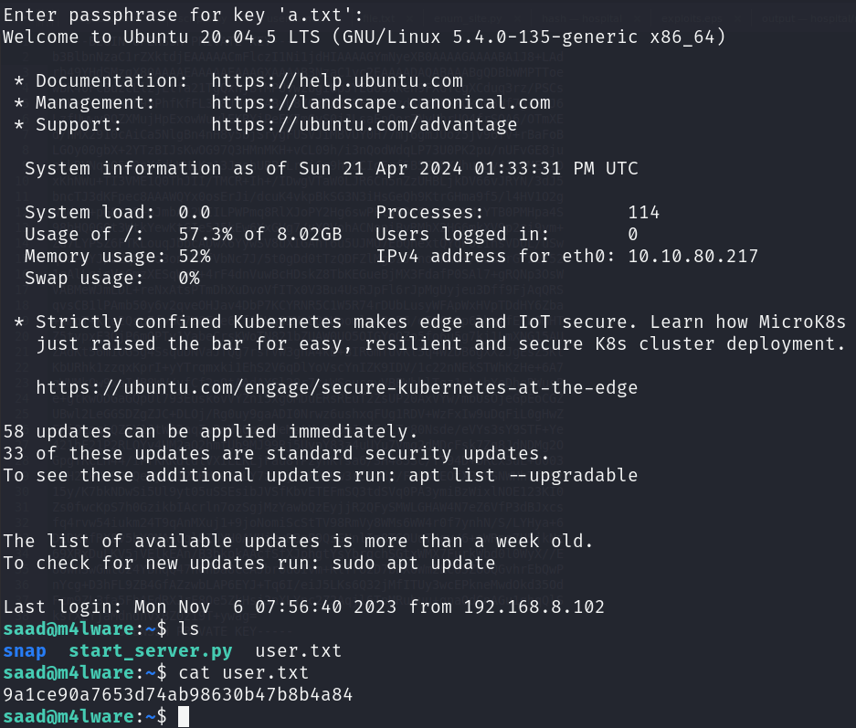<figcaption></figcaption></figure>


## Root

We try our basic enumeration for root through "sudo -l" but don't have the password, but after enumeration our home directory find that our bash history stays throughout sessions. We check the bash history and find our command that gives us the ability to run the sudo binary.

<figure>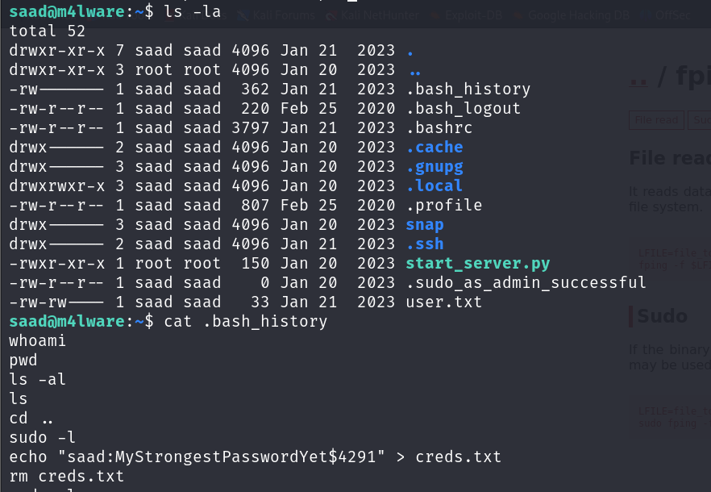<figcaption></figcaption></figure>


Finding our password, we check our privileges and find we can run the "ping" binary as rood, with LD\_PRELOAD enabled.

&#x20;

<figure>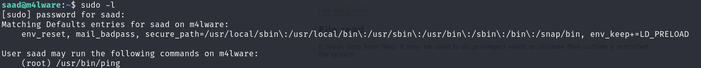<figcaption></figcaption></figure>

Abusing LD\_PRELOAD for root is quite a common privilege escalation so we know the process from here. We follow the steps outlined in this article and get root!&#x20;



<figure>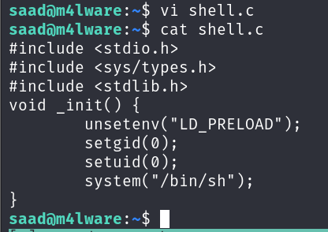<figcaption></figcaption></figure>

<figure>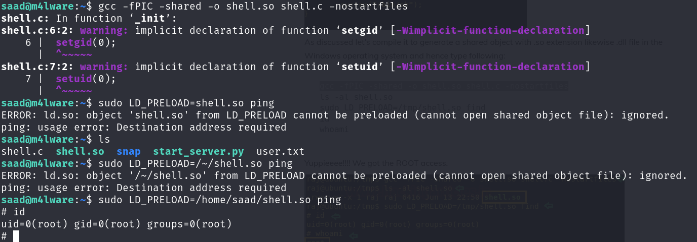<figcaption></figcaption></figure>
