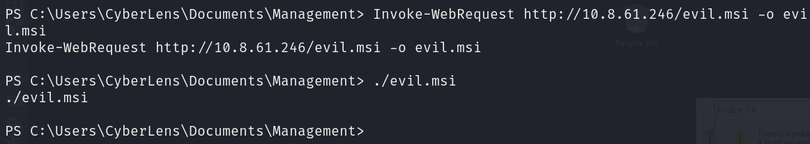

# TryHackMe - CyberLens

## Enumeration

As always, we start by conducting our nmap which reveals a HTTP server running aswell as RDP.

```
# Nmap 7.94SVN scan initiated Sat May 18 10:29:36 2024 as: nmap -sCV -oN nmap/output cyberlens.thm
Nmap scan report for cyberlens.thm (10.10.157.154)
Host is up (0.031s latency).
Not shown: 995 closed tcp ports (conn-refused)
PORT     STATE SERVICE       VERSION
80/tcp   open  http          Apache httpd 2.4.57 ((Win64))
|_http-server-header: Apache/2.4.57 (Win64)
| http-methods: 
|_  Potentially risky methods: TRACE
|_http-title: CyberLens: Unveiling the Hidden Matrix
135/tcp  open  msrpc         Microsoft Windows RPC
139/tcp  open  netbios-ssn   Microsoft Windows netbios-ssn
445/tcp  open  microsoft-ds?
3389/tcp open  ms-wbt-server Microsoft Terminal Services
| ssl-cert: Subject: commonName=CyberLens
| Not valid before: 2024-05-17T14:27:27
|_Not valid after:  2024-11-16T14:27:27
|_ssl-date: 2024-05-18T14:29:54+00:00; +1s from scanner time.
| rdp-ntlm-info: 
|   Target_Name: CYBERLENS
|   NetBIOS_Domain_Name: CYBERLENS
|   NetBIOS_Computer_Name: CYBERLENS
|   DNS_Domain_Name: CyberLens
|   DNS_Computer_Name: CyberLens
|   Product_Version: 10.0.17763
|_  System_Time: 2024-05-18T14:29:46+00:00
Service Info: OS: Windows; CPE: cpe:/o:microsoft:windows

Host script results:
| smb2-security-mode: 
|   3:1:1: 
|_    Message signing enabled but not required
| smb2-time: 
|   date: 2024-05-18T14:29:47
|_  start_date: N/A

Service detection performed. Please report any incorrect results at https://nmap.org/submit/ .
# Nmap done at Sat May 18 10:29:53 2024 -- 1 IP address (1 host up) scanned in 17.97 seconds
```

We start by adding the host to our `/etc/hosts` and then run GoBuster & Wfuzz to scan for directories and subdomains as we explore the website.

&#x20;

<figure><figcaption></figcaption></figure>


We find nothing of interest from either of these scans but manually looking at the website we find an "Image Metadata Checker".

<figure><figcaption></figcaption></figure>

We upload an image and see that it appears to be displaying the metadata of this image in a JSON format, identifiable by the curly brackets and comma on each new line.&#x20;

<figure><figcaption></figcaption></figure>

Eager to see what's under the hood, we look at the source code and find a set of `<script>` functions which, upon opening, appear to contain the JavaScript related to this.

<figure><figcaption></figcaption></figure>

Interesting... this server is running another webserver on port 61777. We remove `/meta` and head to the webpage, and our greeted with the backend for Apache Tika 1.17.&#x20;

<figure><figcaption></figcaption></figure>

## User

We Google this service with "exploit" attached onto the end and find a Rapid7 page so decide to use MetaSploit to get onto the box.



<figure><figcaption></figcaption></figure>


We configure the exploit and running it, we get a shell. We find `user.txt` in the Documents folder and begin our enumeration for root.

## Root

Nothing stands out too much at first until we look at the running processes. We're still in a command-line shell at this point so are relying on finding something obvious and sure enough, there's some random process running.

<figure><figcaption></figcaption></figure>

We can't find this executable in the directory we were in, so head to the root of the filesystem and try again.

<figure><figcaption></figcaption></figure>

We back out of our meterpreter shell and download the file and attempt to reverse engineer it, unfortunately not finding anything of use.&#x20;

<figure><figcaption></figcaption></figure>

At this point in the box, I was stumped, I was convinced I'd missed anything and there was nothing that had grabbed my interest from winPEAS so took a break, came back and decided to go back to basics. Looking through the contents of the user folder we find that within some directories is a file called "CyberLens-Management.txt". Opening the file, we get user credentials and RDP into the system.

<figure><figcaption></figcaption></figure>

Running the executable we'd found earlier, nothing happened. We found a base64 file and decrypting the output doesn't give us anything of use, so we appear to have reached a rabbit hole. Backing out again, we use PrivescCheck to check whether there's any low hanging fruit we missed when looking at winPEAS and sure enough, there is.

<figure><figcaption></figcaption></figure>

We have permissions to always install programs as an elevated user. This permission allows all users to run any MSI file with elevated privileges. More information regarding how this can be abuse is available from the link below, but with this information, we can get root.



We start by generating our shell, with the only thing that we change being the LHOST and LPORT.

<figure><figcaption></figcaption></figure>

We then continue by starting our netcat listener.

<figure><figcaption></figcaption></figure>

And then finally, we download the file onto the machine and run it!

<figure><figcaption></figcaption></figure>

Waiting a couple seconds we get a response on our listener and we have `NT AUTHORITY/SYSTEM`.&#x20;

<figure><figcaption></figcaption></figure>
