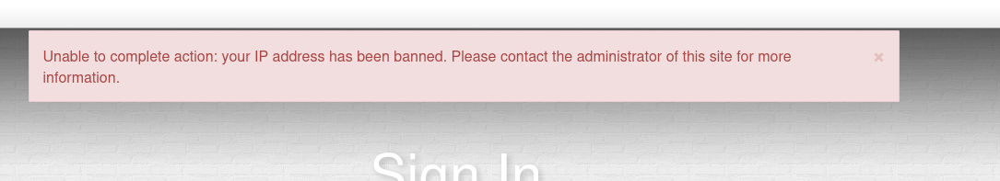
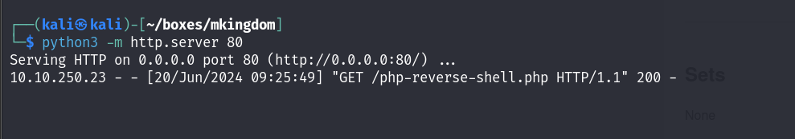
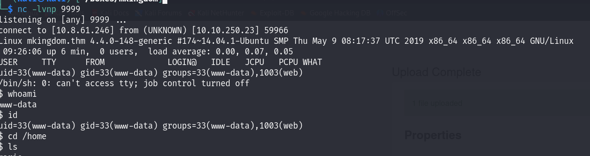
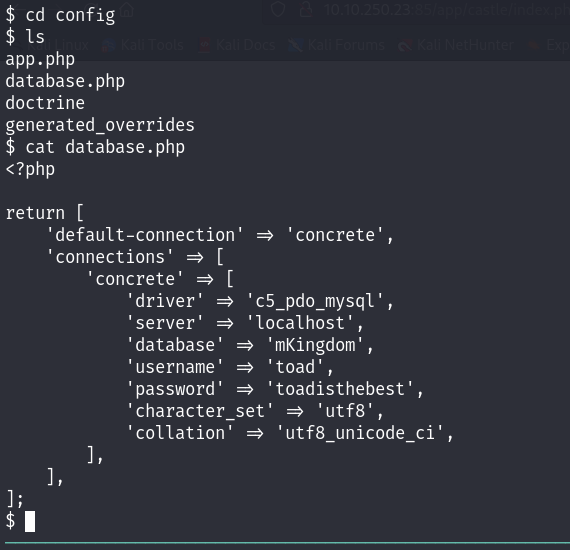
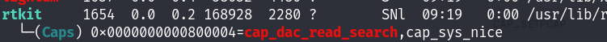
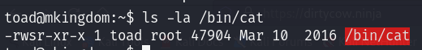
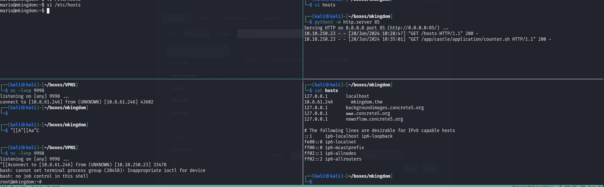

# TryHackMe - mKingdom

As always we start with our nmap scan which reveals a HTTP server running on port 85.

```
# Nmap 7.94SVN scan initiated Thu Jun 20 08:47:17 2024 as: nmap -sCV -oN nmap/output 10.10.9.161
Nmap scan report for 10.10.9.161
Host is up (0.057s latency).
Not shown: 999 closed tcp ports (reset)
PORT   STATE SERVICE VERSION
85/tcp open  http    Apache httpd 2.4.7 ((Ubuntu))
|_http-server-header: Apache/2.4.7 (Ubuntu)
|_http-title: 0H N0! PWN3D 4G4IN

Service detection performed. Please report any incorrect results at https://nmap.org/submit/ .
# Nmap done at Thu Jun 20 08:47:25 2024 -- 1 IP address (1 host up) scanned in 8.28 seconds
```

We head to the website and are greeted with some Bowser ASCII art. From here we do some directory bruteforcing which leads us to /app which as we follow the general path eventually brings us to "Toad's Website".

<figure><figcaption></figcaption></figure>

We look around the website and don't really find anything of use until we stumble across a login page. Knowing that this is Toad's Website we assume Toad will be a user and start bruteforcing a password. What we didn't know.. was that there is some kind of ratelimiting on the box, and as such we cannot do that.

<figure><figcaption></figcaption></figure>

<figure><figcaption></figcaption></figure>

We have to reset the box here but learn a valuable lesson that running in guns blazing won't always work, as it didn't here. We reset the box and decide to try something a little simpler and instead try default credential combinations and get a hit with admin:password!

## Foothold

From here we're logged in and can upload our own files, but when trying to upload a PHP file are greeted with an error message we find that we cannot upload these files because it's not included in the allow list. We find the allow list and append ".php" to the end!, trying to upload our reverse shell again, which is a success.

<figure><figcaption></figcaption></figure>

<figure><figcaption></figcaption></figure>

With our shell uploaded we get a link for where to access it, so click on that link and get a shell from our Netcat listener!

<figure><figcaption></figcaption></figure>

We get onto the box, find that we don't have sudo privileges so stabilise our shell and start looking into the contents of the web app. Sure enough, we find credentials for the Toad user.

<figure><figcaption></figcaption></figure>

## User

From our Toad shell, we find multiple red herrings with SUID perms on the "cat" binary and CAP\_DAC\_READ\_SEARCH capabilities on another binary, unfortunately neither of these provide us a path forwards.

<figure><figcaption></figcaption></figure>

<figure><figcaption></figcaption></figure>

From here we decide to go back to basics and check our environment variables where we weirdly find a "PWD\_TOKEN" which when decoded, gives us the password for the Mario user.

<figure><figcaption></figcaption></figure>

## Root

From here, once again we get caught in the many rabbit holes this room has to offer before eventually putting some pieces of this puzzle together. We noticed a "counter.sh" file in the application which checks the amount of files in the application which is owned by root, but we also noticed that we have permissions to edit the /etc/hosts files on this machine, and as such could redirect a request for this file if one were made. We load PSpy onto the box in the hopes of finding something of interest and sure enough we do!

<figure><figcaption></figcaption></figure>

A request is made to mkingdom.thm and then the file is executed. How can we exploit this though?


Well.. we can start by redirecting mkingdom.thm to our VPN IP, making a bash script to spawn us with a shell and then waiting for the automatic job to run and execute our script! We start by making our bash script:

<figure><figcaption></figcaption></figure>

We'll then need to create the necessary directories for the script to find the file it's searching for.

<figure><figcaption></figcaption></figure>


With all of these steps setup, we wait and eventually get our reverse shell!

<figure><figcaption></figcaption></figure>


The final task of this box is reading the flags... Although we're the root user "toad" owns the cat binary and therefore we cannot use that. Of our options here, we could copy our cat binary onto the machine and use that one, or get creative and use another tool for reading files! I personally chose "head" but there are many options.&#x20;
