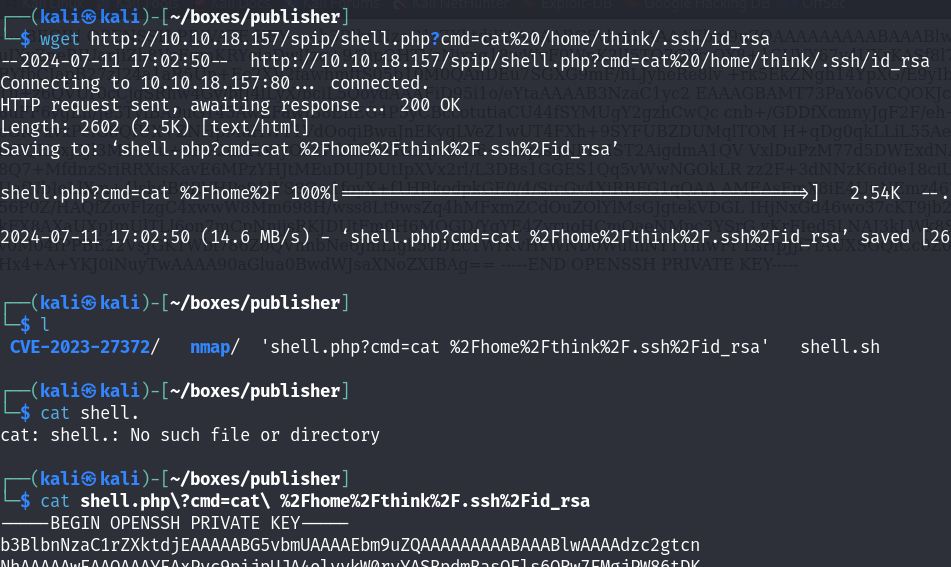
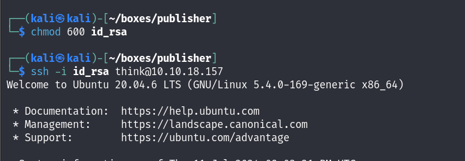
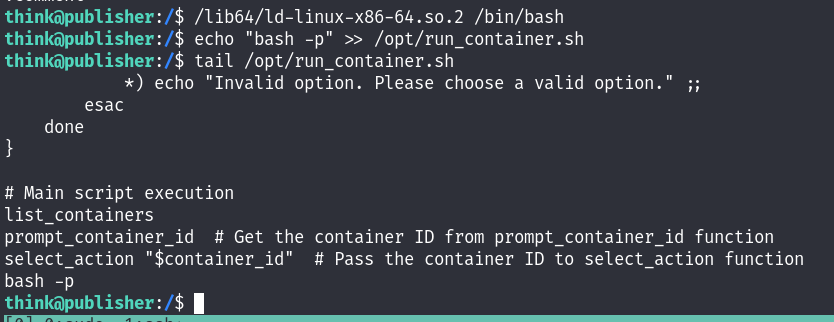

# TryHackMe - Publisher

## Enumeration

```
# Nmap 7.94SVN scan initiated Thu Jul 11 16:49:56 2024 as: nmap -sCV -oN nmap/output 10.10.18.157
Nmap scan report for 10.10.18.157
Host is up (0.026s latency).
Not shown: 998 closed tcp ports (conn-refused)
PORT   STATE SERVICE VERSION
22/tcp open  ssh     OpenSSH 8.2p1 Ubuntu 4ubuntu0.10 (Ubuntu Linux; protocol 2.0)
| ssh-hostkey: 
|   3072 44:5f:26:67:4b:4a:91:9b:59:7a:95:59:c8:4c:2e:04 (RSA)
|   256 0a:4b:b9:b1:77:d2:48:79:fc:2f:8a:3d:64:3a:ad:94 (ECDSA)
|_  256 d3:3b:97:ea:54:bc:41:4d:03:39:f6:8f:ad:b6:a0:fb (ED25519)
80/tcp open  http    Apache httpd 2.4.41 ((Ubuntu))
|_http-title: Publisher's Pulse: SPIP Insights & Tips
|_http-server-header: Apache/2.4.41 (Ubuntu)
Service Info: OS: Linux; CPE: cpe:/o:linux:linux_kernel

Service detection performed. Please report any incorrect results at https://nmap.org/submit/ .
# Nmap done at Thu Jul 11 16:50:04 2024 -- 1 IP address (1 host up) scanned in 7.94 seconds
```

We only have HTTP and SSH open so instantly head to the website and begin exploring. We run GoBuster as we look about which, after changing our wordlist a few times, reveals a "spip" directory which appears to just have some articles on it, but utilising Wappalyser, reveals the version of software running on this box.

<figure><figcaption></figcaption></figure>


"SPIP 4.2.0" seems great, so we pass this onto Google and search for exploits which reveals an RCE vulnerability.



## User

The usage of the exploit is generally for getting our own shell and running it, although after trying a normal reverse shell, we have no luck. We instead decide to give ourselves command execution by adding PHP code to our own file on the box with the payload of&#x20;

```
<?=`$_GET[cmd]`?>
```

Which we Base64 encode to avoid issues with being parsed, and then decode on the box and save into a PHP file.

<figure><figcaption></figcaption></figure>

<figure><figcaption></figcaption></figure>

We have command execution! Looking at our current directory, we're in the user think's home directory and inside a few directories, so do our enumeration and find an SSH key, which we copy over, format correctly and then log into the box with.&#x20;

<figure><figcaption></figcaption></figure>

<figure><figcaption></figcaption></figure>

## Root

Since we're onto the box now we start doing our standard enumeration and check for SUID binaries which reveals a script we aren't familar with.

<figure><figcaption></figcaption></figure>

We start by checking the `strings` of this binary incase there is anything of use which reveals a script that is being ran in `/opt/run_container.sh`, but weirdly we can't list the files in the `/opt` directory although we can read files that we know exist, such as this one. We check what permissions we do have over this binary and we have full permissions!

<figure><figcaption></figcaption></figure>

&#x20;So surely we can just spawn ourselves into a bash shell, since we have SUID permissions and we'll be root? Well, we try this and we don't have permission, weirdly enough, but we also notice something useful, we're in a "ash" shell, not "bash".

<figure><figcaption></figcaption></figure>

Here's where the real priv-esc comes in, we need to a find a way out of this. At this point we head back to our `strings` output and we find a compiler that was presumably used for the `run_container` binary, but we decide to try it on `/bin/bash` aswell. This loads the shared libraries and dynamic linker to ensure the binary will work. Taking this stab in the dark works successfully and gives us full access to the `/opt` directory and we can add `bash -p` to the shell script.

<figure><figcaption></figcaption></figure>

<figure><figcaption></figcaption></figure>

We run through the script and start our container, which triggers our SUID binary and gives us euid root!&#x20;

<figure><figcaption></figcaption></figure>

This gives us our foot flag and marks the box!
