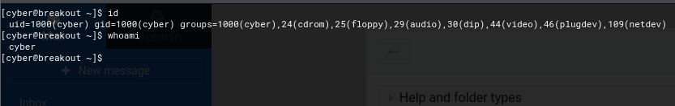

# VulnHub - Empire Breakout

As usual, we start with our Nmap scan which reveals three webservers and two SMB ports running.

```
# Nmap 7.94SVN scan initiated Sat May 25 13:46:45 2024 as: nmap -sCV -oN nmap/output 192.168.0.22
Nmap scan report for 192.168.0.22
Host is up (0.0048s latency).
Not shown: 995 filtered tcp ports (no-response)
PORT      STATE SERVICE     VERSION
80/tcp    open  http        Apache httpd 2.4.51 ((Debian))
|_http-server-header: Apache/2.4.51 (Debian)
|_http-title: Apache2 Debian Default Page: It works
139/tcp   open  netbios-ssn Samba smbd 4.6.2
445/tcp   open  netbios-ssn Samba smbd 4.6.2
10000/tcp open  http        MiniServ 1.981 (Webmin httpd)
|_http-title: 200 &mdash; Document follows
|_http-server-header: MiniServ/1.981
20000/tcp open  http        MiniServ 1.830 (Webmin httpd)
|_http-title: 200 &mdash; Document follows

Host script results:
| smb2-time: 
|   date: 2024-05-25T17:47:05
|_  start_date: N/A
|_nbstat: NetBIOS name: BREAKOUT, NetBIOS user: <unknown>, NetBIOS MAC: <unknown> (unknown)
| smb2-security-mode: 
|   3:1:1: 
|_    Message signing enabled but not required

Service detection performed. Please report any incorrect results at https://nmap.org/submit/ .
# Nmap done at Sat May 25 13:47:36 2024 -- 1 IP address (1 host up) scanned in 50.87 seconds
```

Immediately we load the webservers running on abnormally high ports and are greeted with two login pages of different versions of the MiniServ service. We try some vulnerabilities that we find online although none of these provide us with any kind of useful results.&#x20;


We then decide to enumerate Samba to see if we can find anything of interest, and Anonymous login is enabled, so we are able to enumerate users on the machine. We find the "cyber" user and then, after finding nothing else of interest, decide to explore the HTTP server on port 80.

<figure><figcaption></figcaption></figure>

Looking over this web page, it appears to be a landing page for a default Apache2 install, although looking at the source code we find a comment hidden hundreds of lines down.

<figure><figcaption></figcaption></figure>

We know this is Brainfuck, so pass it to a decoder and get some kind of random string, ".2uqPEfj3D\<P'a-3". Bearing in mind we have a username and what could be a password, we head to the web page on port 10000 and attempt to log in.

&#x20;

<figure><figcaption></figcaption></figure>

Unsuccessful on port 10000, we try port 20000. Sure enough, it works! We don't appear to have any functionality around this mailbox but poking around we find a command shell and continue with our enumeration from here.

<figure><figcaption></figcaption></figure>

<figure><figcaption></figcaption></figure>

We check our current directory and have a "tar" executable and our user flag. We check the capabilities of the "tar" executable and have `cap_dac_read_search=ep.`

<figure><figcaption></figcaption></figure>

We do some research about this capability and through the following article, find a way for us to create  our privilege escalation.



We're going to copy the `/etc/shadow` file which should contain credentials for us to find the root password, to which we can then upgrade our shell to the root user and get our root flag. Unfortunately, things were not that simple. We copy `/etc/shadow` over and attempt to crack it with John, but to no luck.

<figure><figcaption></figcaption></figure>

Figuring I must've missed something, we enumerate the filesystem further and find a hidden file owned by the root user in "/var/backups"

<figure><figcaption></figcaption></figure>

We use the privilege escalation mentioned above and get what appears to be another password!

<figure><figcaption></figcaption></figure>


The intended way of proceeding from here would be to use `su root` and become the root user, but due to my VM configuration, spawning a shell on my Kali VM was not possible, and therefore we signed out of `cyber` and logged into the root users account on the webpage on port 20000 and had our root flag.&#x20;

<figure><figcaption></figcaption></figure>
